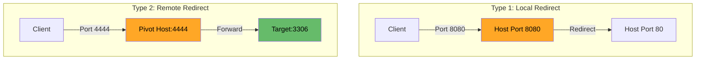
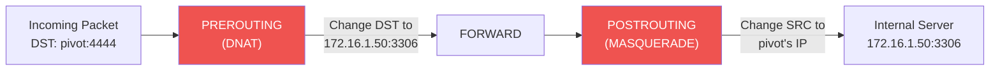
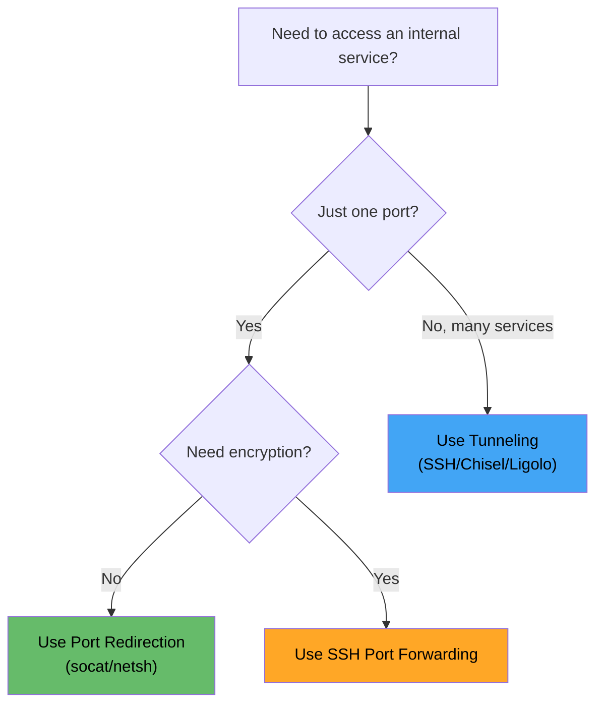

# 🔁 Port Redirection Fundamentals

> **Level: 🟢 Beginner**
> Learn what port redirection is, why it matters, and how to do it with multiple tools.

---

## 📖 Table of Contents

1. [What is Port Redirection?](#-1-what-is-port-redirection)
2. [Why Do We Need It?](#-2-why-do-we-need-it)
3. [Types of Port Redirection](#-3-types-of-port-redirection)
4. [Tool #1: socat](#-4-tool-1-socat)
5. [Tool #2: netcat (nc)](#-5-tool-2-netcat-nc)
6. [Tool #3: iptables (Linux)](#-6-tool-3-iptables-linux)
7. [Tool #4: netsh (Windows)](#-7-tool-4-netsh-windows)
8. [Tool #5: rinetd](#-8-tool-5-rinetd)
9. [Port Redirection vs Tunneling](#-9-port-redirection-vs-tunneling)
10. [Practice Scenarios](#-10-practice-scenarios)

---

## 🧠 1. What is Port Redirection?

### Simple Explanation

Port redirection (also called port forwarding) means:

> **Taking network traffic arriving on one port and sending it to a different port — on the same machine or another machine.**

### Real-World Analogy

```
📞 You call the reception desk (Port 80)
📞 Receptionist forwards your call to the IT department (Port 8080 on another server)
📞 You talk to IT without knowing you were redirected
```

### Technical Flow


---

## 🎯 2. Why Do We Need It?

### The Problem

During a penetration test, you often face this situation:

```
┌──────────────┐                    ┌──────────────┐
│   ATTACKER   │ ──── ✕ ────────→  │   TARGET     │
│   10.0.0.5   │  BLOCKED by       │  172.16.1.50 │
│              │  firewall/NAT      │  (MySQL 3306)│
└──────────────┘                    └──────────────┘
       │                                   ▲
       │ ✔ CAN reach                       │ ✔ CAN reach
       ▼                                   │
┌──────────────┐                           │
│  COMPROMISED │ ──────────────────────────┘
│    HOST      │
│  10.0.0.20   │
│ (dual-homed) │
└──────────────┘
```

### The Solution

You set up port redirection on the **compromised host** so that when you connect to it, traffic gets forwarded to the internal target.

### Common Scenarios Where Port Redirection is Used

| Scenario | Example |
|----------|---------|
| Access internal web app | Redirect port 80/443 from internal server |
| Connect to internal database | Redirect MySQL 3306, MSSQL 1433 |
| Access RDP/SSH on internal host | Redirect port 3389/22 |
| Bypass firewall rules | Redirect through allowed ports |
| Reach segmented network | Use compromised host as bridge |

---

## 🔄 3. Types of Port Redirection

### Type 1: Local Port Redirect (Same Machine)

Traffic arrives on one port and gets redirected to **another port on the same machine**.

```
Traffic → Port 8080 → (Same Machine) → Port 80
```

**Use case**: Service running on an internal-only port that you want to expose.

### Type 2: Remote Port Redirect (Different Machine)

Traffic arrives on one machine and gets forwarded to a **port on a different machine**.

```
Traffic → Pivot:4444 → (Forwarded) → Target:3306
```

**Use case**: Accessing internal services through a compromised host.

### Flow Diagram



---

## 🔧 4. Tool #1: socat

### What is socat?

**socat** (SOcket CAT) is like a Swiss Army knife for network connections. It can create bidirectional data streams between almost anything.

### Install

```bash
# Debian/Ubuntu
sudo apt install socat

# CentOS/RHEL
sudo yum install socat
```

### Basic Port Redirect (Same Machine)

Redirect traffic from port 8080 to port 80 on localhost:

```bash
socat TCP-LISTEN:8080,fork TCP:127.0.0.1:80
```

**Breakdown**:
| Part | Meaning |
|------|---------|
| `TCP-LISTEN:8080` | Listen on port 8080 |
| `fork` | Handle multiple connections (don't just handle one) |
| `TCP:127.0.0.1:80` | Forward to localhost port 80 |

### Remote Port Redirect (Different Machine)

Forward traffic to an internal server:

```bash
# On compromised host (10.0.0.20)
socat TCP-LISTEN:4444,fork TCP:172.16.1.50:3306
```

Now from attacker machine:
```bash
mysql -h 10.0.0.20 -P 4444 -u root -p
```

You're connecting to the **internal MySQL** through the pivot!

### Run in Background

```bash
socat TCP-LISTEN:4444,fork TCP:172.16.1.50:3306 &
```

### Bind to All Interfaces

```bash
socat TCP-LISTEN:4444,fork,bind=0.0.0.0 TCP:172.16.1.50:3306
```

### Full Scenario Walkthrough

```
┌──────────────┐     ┌──────────────────────┐     ┌──────────────┐
│   ATTACKER   │     │   COMPROMISED HOST    │     │  INTERNAL    │
│   10.0.0.5   │────→│   10.0.0.20           │────→│  172.16.1.50 │
│              │     │                        │     │              │
│ mysql -h     │     │ socat TCP-LISTEN:4444  │     │  MySQL :3306 │
│ 10.0.0.20    │     │       fork             │     │              │
│ -P 4444      │     │ TCP:172.16.1.50:3306   │     │              │
└──────────────┘     └──────────────────────┘     └──────────────┘
```

### socat Quick Reference

| Command | Purpose |
|---------|---------|
| `socat TCP-LISTEN:P1,fork TCP:IP:P2` | Basic port redirect |
| `socat TCP-LISTEN:P1,fork,reuseaddr TCP:IP:P2` | Reuse port if in use |
| `socat TCP-LISTEN:P1,fork,bind=0.0.0.0 TCP:IP:P2` | Bind all interfaces |
| `socat TCP4-LISTEN:P1,fork TCP4:IP:P2` | Force IPv4 |
| `socat -d -d TCP-LISTEN:P1,fork TCP:IP:P2` | Verbose/debug mode |

---

## 🔧 5. Tool #2: netcat (nc)

### What is netcat?

**netcat** is the "Swiss Army knife of networking." It can read/write data across network connections. However, for port redirection, netcat is more limited than socat — it typically handles **one connection at a time** unless scripted.

### Method 1: Named Pipe (FIFO) Redirect

```bash
# Create a named pipe
mkfifo /tmp/backpipe

# Set up the redirect
nc -lvp 4444 < /tmp/backpipe | nc 172.16.1.50 3306 > /tmp/backpipe
```

**How it works**:


**Breakdown**:
| Part | Meaning |
|------|---------|
| `mkfifo /tmp/backpipe` | Creates a named pipe for two-way data |
| `nc -lvp 4444` | Listen on port 4444 |
| `< /tmp/backpipe` | Read return data from the backpipe |
| `\| nc 172.16.1.50 3306` | Forward everything to target |
| `> /tmp/backpipe` | Write return data to the backpipe |

### Method 2: Using ncat (Nmap's netcat)

`ncat` is the improved version bundled with Nmap. It supports the `--sh-exec` flag:

```bash
ncat -lvp 4444 --sh-exec "ncat 172.16.1.50 3306"
```

**This is cleaner** — every connection to port 4444 gets forwarded to the target.

### Cleanup

```bash
rm /tmp/backpipe
```

### Limitations of netcat for Port Redirection

| Limitation | Details |
|-----------|---------|
| Single connection (basic nc) | Only handles one client at a time |
| No encryption | Traffic is in plaintext |
| Fragile | Pipe can break on disconnect |
| No fork | Unlike socat, can't auto-handle multiple connections |

> 💡 **Tip**: Use `ncat` (from Nmap) or `socat` instead of basic `nc` when possible.

---

## 🔧 6. Tool #3: iptables (Linux)

### What is iptables?

**iptables** is the Linux kernel firewall. It can redirect traffic at the kernel level — very efficient and transparent to applications.

> ⚠️ **Requires root privileges** on the pivot host.

### Enable IP Forwarding First

```bash
echo 1 > /proc/sys/net/ipv4/ip_forward
```

Or persistently:
```bash
sysctl -w net.ipv4.ip_forward=1
```

### Port Redirect Rule

Forward all traffic arriving on port 4444 to internal server 172.16.1.50 on port 3306:

```bash
# Redirect incoming packets
iptables -t nat -A PREROUTING -p tcp --dport 4444 -j DNAT --to-destination 172.16.1.50:3306

# Allow forwarding
iptables -t nat -A POSTROUTING -j MASQUERADE

# Allow the forwarded traffic
iptables -A FORWARD -p tcp -d 172.16.1.50 --dport 3306 -j ACCEPT
```

### How iptables NAT Works



### View Current Rules

```bash
iptables -t nat -L -n -v
```

### Remove/Flush Rules

```bash
# Remove specific rule
iptables -t nat -D PREROUTING -p tcp --dport 4444 -j DNAT --to-destination 172.16.1.50:3306

# Flush all NAT rules (careful!)
iptables -t nat -F
```

### Advantages and Disadvantages

| ✅ Advantages | ❌ Disadvantages |
|--------------|-----------------|
| Kernel-level (very fast) | Requires root |
| Transparent to applications | Complex syntax |
| Handles unlimited connections | Easy to misconfigure |
| Persistent (can be saved) | Can lock you out if wrong |

---

## 🔧 7. Tool #4: netsh (Windows)

### What is netsh?

**netsh** is Windows' built-in network configuration tool. It can do port forwarding using `interface portproxy`.

> ⚠️ **Requires Administrator privileges**.

### Basic Port Redirect

```cmd
netsh interface portproxy add v4tov4 listenport=4444 listenaddress=0.0.0.0 connectport=3306 connectaddress=172.16.1.50
```

**Breakdown**:
| Part | Meaning |
|------|---------|
| `v4tov4` | IPv4 to IPv4 forwarding |
| `listenport=4444` | Listen on port 4444 |
| `listenaddress=0.0.0.0` | Listen on all interfaces |
| `connectport=3306` | Forward to port 3306 |
| `connectaddress=172.16.1.50` | Forward to this IP |

### View active port forwards

```cmd
netsh interface portproxy show all
```

### Delete a port forward

```cmd
netsh interface portproxy delete v4tov4 listenport=4444 listenaddress=0.0.0.0
```

### Reset all port forwards

```cmd
netsh interface portproxy reset
```

### Important: Open Firewall

You must also allow the listening port through Windows Firewall:

```cmd
netsh advfirewall firewall add rule name="Port 4444 Redirect" dir=in action=allow protocol=TCP localport=4444
```

### Delete firewall rule when done

```cmd
netsh advfirewall firewall delete rule name="Port 4444 Redirect"
```

> 📝 **Note**: For a deeper dive into Windows tunneling (plink, OpenSSH, etc.), see [05_windows_tunneling_tools.md](./05_windows_tunneling_tools.md).

---

## 🔧 8. Tool #5: rinetd

### What is rinetd?

**rinetd** is a lightweight TCP redirect daemon for Linux. It's configured via a file and runs as a service — perfect for persistent redirects.

### Install

```bash
sudo apt install rinetd
```

### Configuration File

Edit `/etc/rinetd.conf`:

```
# Format: bind_address bind_port connect_address connect_port
0.0.0.0 4444 172.16.1.50 3306
0.0.0.0 8080 172.16.1.50 80
0.0.0.0 2222 172.16.1.100 22
```

### Start the Service

```bash
sudo systemctl start rinetd
sudo systemctl enable rinetd  # Start on boot
```

### Check Status

```bash
sudo systemctl status rinetd
```

### Why Use rinetd?

| Scenario | Why rinetd |
|----------|------------|
| Multiple persistent redirects | Config file is cleaner than multiple socat processes |
| Headless servers | Runs as daemon, no terminal needed |
| Simple requirements | Just TCP redirect, nothing fancy |

---

## ⚖️ 9. Port Redirection vs Tunneling

| Feature | Port Redirection | Tunneling |
|---------|-----------------|-----------|
| **What** | Forward one specific port | Create encrypted path for traffic |
| **Scope** | Single service / single port | Can forward many ports or entire subnets |
| **Encryption** | Usually none | Usually encrypted (SSH, etc.) |
| **Complexity** | Simple | More complex |
| **Use Case** | Quick access to one service | Full network pivoting |
| **Tools** | socat, netcat, iptables, netsh | SSH, Chisel, Ligolo-ng |
| **Detection** | Easy to detect | Harder to detect (encrypted) |

### When to Use What?



---

## 🧪 10. Practice Scenarios

### Scenario 1: Basic socat Redirect (Easy)

**Setup**: Two VMs — Kali (attacker) and Ubuntu (target with web server on port 80)

```bash
# On Ubuntu (simulate: web server only on localhost)
python3 -m http.server 80 --bind 127.0.0.1

# On same Ubuntu (redirect external port to internal)
socat TCP-LISTEN:8080,fork TCP:127.0.0.1:80

# From Kali
curl http://ubuntu-ip:8080
```

### Scenario 2: Named Pipe Redirect (Medium)

```bash
# On pivot
mkfifo /tmp/bp
nc -lvp 5555 < /tmp/bp | nc 10.10.10.5 22 > /tmp/bp

# From attacker
ssh user@pivot-ip -p 5555
# This connects to 10.10.10.5:22 through the pivot
```

### Scenario 3: iptables Full Redirect (Advanced)

```bash
# On compromised Linux host
echo 1 > /proc/sys/net/ipv4/ip_forward
iptables -t nat -A PREROUTING -p tcp --dport 9090 -j DNAT --to-destination 10.10.10.5:80
iptables -t nat -A POSTROUTING -j MASQUERADE
iptables -A FORWARD -p tcp -d 10.10.10.5 --dport 80 -j ACCEPT

# From attacker
curl http://compromised-host:9090
# Reaches internal web server at 10.10.10.5:80
```

---

## 🔑 Key Takeaways

1. **Port redirection** is the simplest form of pivoting — forward one port to another
2. **socat** is the most versatile tool for port redirection
3. **netcat** works in a pinch but is limited to single connections
4. **iptables** is powerful but requires root and careful configuration
5. **netsh** is your go-to on Windows
6. **rinetd** is best for persistent, multi-port redirects
7. Always choose the **right tool** for the situation

---

## ⏭️ Next: [SSH Tunneling Deep Dive →](./02_SSH_tunneling_deep_dive.md)
