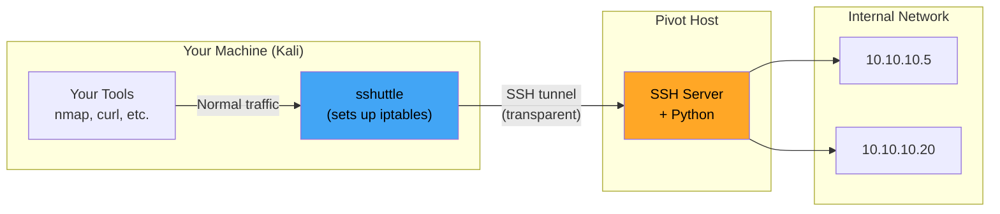

# 🚇 sshuttle & VPN Tunneling

> **Level: 🟡 Intermediate**
> Use sshuttle — the "poor man's VPN" — to transparently route traffic through SSH.

---

## 📖 Table of Contents

1. [What is sshuttle?](#-1-what-is-sshuttle)
2. [How sshuttle Works](#-2-how-sshuttle-works)
3. [Installation](#-3-installation)
4. [Basic Usage](#-4-basic-usage)
5. [Routing Entire Subnets](#-5-routing-entire-subnets)
6. [Advanced Options](#-6-advanced-options)
7. [sshuttle vs Other Tools](#-7-sshuttle-vs-other-tools)
8. [Limitations](#-8-limitations)
9. [Practice Scenarios](#-9-practice-scenarios)

---

## 🧠 1. What is sshuttle?

**sshuttle** creates a transparent VPN-like tunnel over SSH. Unlike SSH dynamic forwarding (`-D`), sshuttle:

- ✅ Doesn't require proxychains
- ✅ Routes entire subnets transparently
- ✅ Applications work without any configuration
- ✅ Handles DNS through the tunnel
- ✅ Only requires SSH access (and Python on the pivot)

### The "Poor Man's VPN" Concept

```
Regular VPN:
  Requires VPN server software, certificates, configuration
  
sshuttle:
  Just needs SSH access + Python on the remote host
  Creates VPN-like routing automatically
```

---

## 🏗️ 2. How sshuttle Works

### Architecture



### How The Magic Works

1. sshuttle establishes an SSH connection to the pivot
2. It uploads a small Python script to the pivot automatically
3. It modifies **local iptables/NAT rules** to intercept traffic destined for the specified subnets
4. Intercepted traffic is forwarded through the SSH tunnel
5. The Python script on the pivot forwards traffic to internal targets
6. **Your applications have no idea** — they just work normally!

### Traffic Flow

```
1. You run: curl http://10.10.10.5
2. iptables on YOUR machine intercepts the packet (dst: 10.10.10.0/24)
3. Packet is redirected to sshuttle
4. sshuttle sends it through SSH tunnel to pivot
5. Python script on pivot forwards to 10.10.10.5
6. Response comes back through the same path
7. curl gets the response — no proxy config needed!
```

---

## 📦 3. Installation

```bash
# Debian/Ubuntu
sudo apt install sshuttle

# CentOS/RHEL
sudo yum install sshuttle

# Python pip
pip install sshuttle

# Arch Linux
sudo pacman -S sshuttle
```

### Requirements

| Machine | Requirement |
|---------|-------------|
| **Your machine (Kali)** | sshuttle installed, root/sudo |
| **Pivot host** | SSH access + Python (2 or 3) installed |

> ⚠️ sshuttle requires **root/sudo** on your machine (to modify iptables). It does NOT need root on the pivot.

---

## 🔥 4. Basic Usage

### Route All Traffic to a Subnet

```bash
sshuttle -r user@pivot 10.10.10.0/24
```

**That's it!** Now all traffic to `10.10.10.0/24` goes through the pivot.

### Breakdown

```
sshuttle -r [user]@[pivot_host] [subnet_to_route]
            ▲        ▲                ▲
            │        │                │
         SSH user  Pivot IP     Internal subnet
                                you want to reach
```

### Test It

```bash
# These all work without proxychains!
curl http://10.10.10.5
nmap 10.10.10.5
ssh user@10.10.10.5
smbclient //10.10.10.5/share
```

### With SSH Key

```bash
sshuttle -r user@pivot -e "ssh -i /path/to/key" 10.10.10.0/24
```

### With Non-Standard SSH Port

```bash
sshuttle -r user@pivot:2222 10.10.10.0/24
# or
sshuttle -r user@pivot -e "ssh -p 2222" 10.10.10.0/24
```

---

## 🌐 5. Routing Entire Subnets

### Single Subnet

```bash
sshuttle -r user@pivot 10.10.10.0/24
```

### Multiple Subnets

```bash
sshuttle -r user@pivot 10.10.10.0/24 172.16.0.0/16 192.168.100.0/24
```

### Route ALL Traffic (Full VPN)

```bash
# Route everything through the pivot
sshuttle -r user@pivot 0.0.0.0/0

# Or shortcut:
sshuttle -r user@pivot 0/0
```

> ⚠️ Routing `0/0` sends ALL your traffic through the pivot — including your SSH connection to the pivot itself! sshuttle handles this by excluding the pivot's IP from the routing.

### Include DNS

```bash
sshuttle --dns -r user@pivot 10.10.10.0/24
```

This routes DNS queries through the tunnel too — useful for resolving internal hostnames.

### Exclude Specific IPs

```bash
sshuttle -r user@pivot 10.10.10.0/24 -x 10.10.10.1
```

The `-x` flag excludes specific addresses from being tunneled.

---

## ⚙️ 6. Advanced Options

### Run in Background (Daemon Mode)

```bash
sshuttle -r user@pivot 10.10.10.0/24 -D
```

### Verbose Mode (Debugging)

```bash
sshuttle -r user@pivot 10.10.10.0/24 -v
sshuttle -r user@pivot 10.10.10.0/24 -vv  # More verbose
```

### Specify Python Path on Pivot

If Python isn't in the default path on the pivot:

```bash
sshuttle -r user@pivot 10.10.10.0/24 --python /usr/bin/python3
```

### Auto-detect Subnets

sshuttle can automatically detect the pivot's subnets:

```bash
sshuttle -r user@pivot --auto-nets
```

This queries the pivot's routing table and routes all its subnets through the tunnel.

### Password Authentication

```bash
# Use sshpass for password auth
sshpass -p 'password' sshuttle -r user@pivot 10.10.10.0/24
```

### All Useful Flags

| Flag | Meaning |
|------|---------|
| `-r user@host` | Remote SSH connection |
| `-D` | Daemon mode (background) |
| `-v` / `-vv` | Verbose / very verbose |
| `--dns` | Route DNS through tunnel |
| `-x IP` | Exclude specific IP from routing |
| `-e "ssh ..."` | Custom SSH command |
| `--auto-nets` | Auto-detect subnets from pivot |
| `--python PATH` | Python path on pivot |
| `-l PORT` | Listen on specific local port |
| `--no-latency-control` | Disable latency optimization |

---

## ⚖️ 7. sshuttle vs Other Tools

| Feature | sshuttle | SSH -D | Chisel | Ligolo-ng |
|---------|----------|--------|--------|-----------|
| **Needs proxychains** | ❌ | ✅ | ✅ | ❌ |
| **Transparent routing** | ✅ | ❌ | ❌ | ✅ |
| **Requires SSH** | ✅ | ✅ | ❌ | ❌ |
| **Requires Python on pivot** | ✅ | ❌ | ❌ | ❌ |
| **Subnet routing** | ✅ | ❌ | ❌ | ✅ |
| **ICMP (ping)** | ❌ | ❌ | ❌ | ✅ |
| **UDP support** | ❌ (TCP only) | ❌ | ❌ | ✅ |
| **Full nmap** | Partial | Limited | Limited | ✅ |
| **Setup complexity** | Very easy | Easy | Easy | Medium |
| **Root on pivot** | ❌ | ❌ | ❌ | ❌ |
| **Root on attacker** | ✅ | ❌ | ❌ | ✅ |

### When to Use sshuttle

- ✅ You have SSH access to the pivot
- ✅ Python is available on the pivot
- ✅ You want transparent routing without proxychains
- ✅ Quick setup needed (one command!)
- ✅ TCP-based tools only

### When NOT to Use sshuttle

- ❌ No SSH access to pivot → Use Chisel
- ❌ No Python on pivot → Use SSH -D or Chisel
- ❌ Need ICMP/UDP → Use Ligolo-ng
- ❌ Need SYN scans → Use Ligolo-ng
- ❌ Cannot get sudo on your machine → Use SSH -D

---

## ⚠️ 8. Limitations

| Limitation | Details | Workaround |
|-----------|---------|------------|
| **TCP only** | No UDP, no ICMP | Use Ligolo-ng for UDP/ICMP |
| **Requires Python on pivot** | Python 2 or 3 must be installed | Check with `which python3` |
| **Requires root locally** | Needs sudo to modify iptables | Run with `sudo` |
| **Nmap limitations** | SYN scan may not work correctly | Use `-sT` scan |
| **Not stealthy** | SSH connection is visible | Use on allowed SSH connections |
| **Single hop only** | Can't easily chain | Use SSH -J for multi-hop |
| **Linux only (client)** | sshuttle runs on Linux/macOS | N/A for Windows attackers |

### Nmap Through sshuttle

```bash
# sshuttle routes TCP, so some nmap features work:

# TCP connect scan — WORKS
nmap -sT 10.10.10.5

# Service detection — WORKS
nmap -sT -sV 10.10.10.5

# SYN scan — MAY NOT WORK (depends on version)
nmap -sS 10.10.10.5

# Ping — DOES NOT WORK
ping 10.10.10.5   # ❌ ICMP not supported

# UDP scan — DOES NOT WORK
nmap -sU 10.10.10.5  # ❌
```

---

## 🧪 9. Practice Scenarios

### Scenario 1: Basic Transparent Pivot

```bash
# One command to rule them all
sudo sshuttle -r user@192.168.1.10 10.10.10.0/24

# Now just use tools normally
curl http://10.10.10.5
nmap -sT -sV 10.10.10.5
firefox http://10.10.10.5  # Open internal web app in browser
```

### Scenario 2: Multiple Subnets + DNS

```bash
sudo sshuttle --dns -r admin@pivot 10.10.10.0/24 172.16.0.0/16

# Internal DNS names now resolve!
curl http://internal-webapp.corp.local
nmap -sT hr-server.corp.local
```

### Scenario 3: Quick Lab Setup

```bash
# Auto-detect internal subnets
sudo sshuttle -r user@pivot --auto-nets -v

# See what subnets were detected and start exploring
nmap -sT -Pn --top-ports 20 10.10.10.0/24
```

### Combining with Other Tools

```bash
# sshuttle + CrackMapExec (no proxychains needed!)
sudo sshuttle -r user@pivot 10.10.10.0/24
crackmapexec smb 10.10.10.0/24

# sshuttle + Impacket
secretsdump.py admin:password@10.10.10.5

# sshuttle + Evil-WinRM
evil-winrm -i 10.10.10.5 -u admin -p password
```

---

## 📋 sshuttle Quick Reference

| Command | Purpose |
|---------|---------|
| `sshuttle -r user@host SUBNET` | Basic transparent routing |
| `sshuttle -r user@host SUBNET1 SUBNET2` | Multiple subnets |
| `sshuttle -r user@host 0/0` | Route ALL traffic |
| `sshuttle --dns -r user@host SUBNET` | Include DNS |
| `sshuttle -r user@host SUBNET -x IP` | Exclude specific IP |
| `sshuttle -r user@host SUBNET -D` | Run in background |
| `sshuttle -r user@host --auto-nets` | Auto-detect subnets |
| `sshuttle -r user@host:PORT SUBNET` | Non-standard SSH port |

---

## ⏮️ [← Proxychains & SOCKS](./06_proxychains_socks.md) | ⏭️ [Double Pivoting (Advanced) →](./08_double_pivoting_advanced.md)
