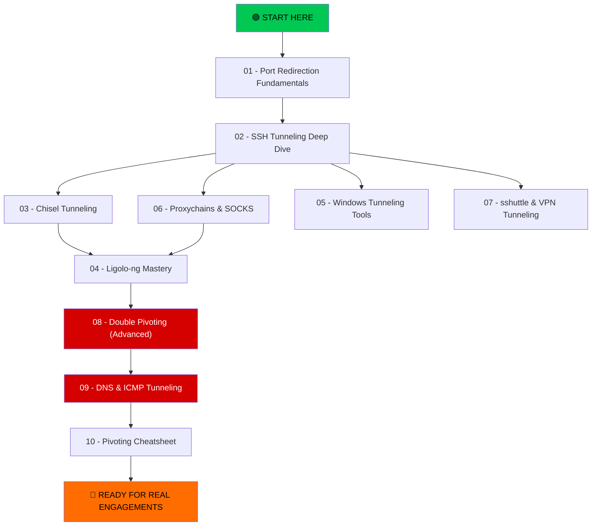

# 🔁 Port Redirection & Tunneling — Complete Guide

> **From beginner fundamentals to advanced pivoting techniques.**
> This series covers every tool, technique, and concept you need to master network pivoting for ethical hacking and penetration testing.

---

## 📊 Learning Path



---

## 📚 Document Index

| # | Document | Level | Description |
|---|----------|-------|-------------|
| 01 | [Port Redirection Fundamentals](./01_port_redirection_fundamentals.md) | 🟢 Beginner | Core concepts, socat, netcat, iptables, netsh basics |
| 02 | [SSH Tunneling Deep Dive](./02_SSH_tunneling_deep_dive.md) | 🟢 Beginner | Local/Remote/Dynamic forwarding, jump hosts, chaining |
| 03 | [Chisel Tunneling](./03_chisel_tunneling.md) | 🟡 Intermediate | Forward & reverse proxy, SOCKS, firewall bypass |
| 04 | [Ligolo-ng Mastery](./04_ligolo_ng_mastery.md) | 🟡 Intermediate | Full subnet routing, TUN interfaces, multi-pivot |
| 05 | [Windows Tunneling Tools](./05_windows_tunneling_tools.md) | 🟡 Intermediate | netsh, plink, Windows OpenSSH, ncat |
| 06 | [Proxychains & SOCKS](./06_proxychains_socks.md) | 🟡 Intermediate | SOCKS proxies, proxychains config, tool integration |
| 07 | [sshuttle & VPN Tunneling](./07_sshuttle_and_vpn_tunneling.md) | 🟡 Intermediate | Poor man's VPN, subnet routing, comparisons |
| 08 | [Double Pivoting (Advanced)](./08_double_pivoting_advanced.md) | 🔴 Advanced | Multi-hop pivoting with SSH, Chisel, Ligolo-ng |
| 09 | [DNS & ICMP Tunneling](./09_dns_icmp_tunneling.md) | 🔴 Advanced | dnscat2, iodine, ptunnel, firewall evasion |
| 10 | [Pivoting Cheatsheet](./10_pivoting_cheatsheet.md) | 📋 Reference | Quick-reference commands, decision flowchart |

---

## 🎯 What You'll Learn

By the end of this series, you will be able to:

- ✅ Understand the difference between port redirection and tunneling
- ✅ Use SSH for local, remote, and dynamic port forwarding
- ✅ Pivot through compromised hosts using Chisel, Ligolo-ng, and sshuttle
- ✅ Tunnel traffic on Windows hosts using netsh and plink
- ✅ Route entire subnets through tunnels
- ✅ Chain multiple pivots (double/triple pivoting)
- ✅ Bypass restrictive firewalls using DNS and ICMP tunnels
- ✅ Choose the right tool for any engagement scenario

---

## 🧩 Core Concept: The Pivoting Problem

```
┌──────────────┐       FIREWALL       ┌──────────────┐       ┌──────────────┐
│   ATTACKER   │ ──────── ✕ ────────→ │   INTERNAL   │       │   INTERNAL   │
│  (Kali/VPS)  │   Can't reach        │  Server (B)  │       │  Server (C)  │
│              │   directly!          │  10.10.10.5   │       │  10.10.10.20 │
└──────────────┘                      └──────────────┘       └──────────────┘
       │                                     ▲                       ▲
       │                                     │                       │
       ▼                                     │                       │
┌──────────────┐                             │                       │
│  COMPROMISED │ ────── CAN REACH ───────────┘───────────────────────┘
│   HOST (A)   │   (dual-homed or
│ 192.168.1.10 │    internal access)
└──────────────┘
```

**The solution**: Use Host A as a **pivot point** to reach B and C through tunneling.

---

## ⚠️ Ethical Reminder

All techniques in this series must **only** be used in:

- 🧪 Lab environments (your home lab)
- 🎯 Authorized penetration tests (with written permission)
- 🏆 CTF competitions
- 🐛 Bug bounty programs (within scope)

**Never use these techniques on systems without explicit written authorization.**

---

## 🚀 Recommended Study Order

1. **Read docs 01 → 02** first — these are the foundation
2. **Pick your tool**: Read 03 (Chisel) OR 04 (Ligolo-ng) based on interest
3. **Read 05 & 06** — Windows pivoting and proxychains are essential
4. **Move to advanced**: 08 (Double Pivoting) and 09 (DNS/ICMP) when comfortable
5. **Keep 10 (Cheatsheet)** open as reference during practice
